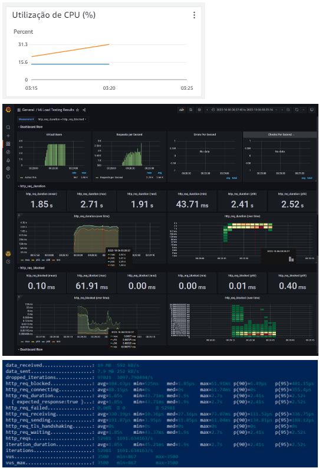

# Introdução

No cenário em constante evolução do desenvolvimento de aplicações web, a eficiente gestão de cargas de trabalho que flutuam ao longo do tempo ganha destaque como um tópico de extrema relevância. Cada empresa e organização apresenta necessidades específicas, e fatores sazonais, aliados a estratégias de marketing, podem desencadear picos abruptos no tráfego de usuários, intensificando, assim, os desafios inerentes à elasticidade de uma aplicação. A elasticidade, que se define como a habilidade de expandir ou reduzir rapidamente os recursos utilizados de acordo com a demanda, configura-se como uma ferramenta essencial para plataformas em nuvem (BREBNER, PAUL, 2012).

A computação em nuvem refere-se à virtualização de recursos de hardware que disponibiliza uma variedade de serviços computacionais, tais como servidores e armazenamento. Em essência, a computação em nuvem é um paradigma que centraliza o compartilhamento de dados e processamento por intermédio de uma rede escalável de nós, englobando desde computadores utilizados por usuários finais até centros de dados e serviços web (KRIUSHANTH, M, 2013).

Neste cenário dinâmico, a implementação de uma aplicação escalável apresenta uma série de desafios significativos. Por um lado, a adoção de soluções locais, como mainframes, pode acarretar custos substanciais, uma vez que requer investimentos em equipamentos e manutenção. Por outro lado, a opção por plataformas em nuvem pode resultar em despesas excessivas, já que o modelo de serviços em nuvem, baseado no pagamento por uso (pay-per-use), oferece aos usuários a vantagem de pagar somente pelo consumo efetivo de recursos. No entanto, essa flexibilidade também traz consigo a necessidade de equilibrar com precisão o custo e a eficiência dos serviços (MOGOUIE, 2015), o que será abordado no presente artigo.

Um estudo de caso no contexto em questão analisa a empresa Stone, que estabeleceu uma parceria com o Instituto de Tecnologia e Liderança (Inteli), visando o desenvolvimento de uma aplicação escalável em sistemas distribuídos. Tal colaboração foi motivada pela posição da Stone como patrocinadora do programa Big Brother Brasil (BBB). Durante os momentos de exposição da plataforma no programa, como nas eliminações conhecidas como "paredões", o site frequentemente experimentava um substancial aumento no tráfego, já que os telespectadores se interessavam em saber sobre a empresa acessando o site, e como há uma grande audiência, a plataforma experienciava picos elevados de acessos. Para a plataforma se manter resiliente nessas situações, era imperativo que sua infraestrutura estivesse adequadamente preparada para acomodar esses acessos sem resultar em quedas de disponibilidade.

A partir dos pontos apresentados, este artigo abordará uma solução altamente escalável para organizações que necessitam de uma elasticidade robusta em suas aplicações. Especificamente, trata-se de lidar com a demanda variável e intensa que pode atingir até 35.000 requisições por segundo durante períodos de sazonalidade. Essa solução visa garantir a operação contínua e sem interrupções mesmo diante das oscilações de tráfego.

Para atingir esse objetivo, optou-se por empregar sistemas distribuídos na nuvem, utilizando os serviços disponibilizados pela Amazon Web Services (AWS), renomada provedora de soluções em nuvem. Essa escolha visa a preparação da infraestrutura da aplicação para a capacidade elástica desejada. No âmbito técnico, a solução proposta foi validada por meio da implementação de um cenário de testes. Para tal, foi desenvolvida uma loja virtual, sendo o backend construído em Node.js/Express, o frontend em React.js, e o armazenamento de dados gerenciado pelo MySQL, empregando o Amazon RDS (Relational Database Service) como o serviço de banco de dados. Esses componentes foram selecionados de modo a simular um ambiente realista e funcional para avaliar a solução em questão.

Portanto, este artigo examinará detalhadamente a estratégia adotada para alcançar a escalabilidade desejada, explorando as vantagens da computação em nuvem e os benefícios práticos da abordagem de sistemas distribuídos. Além disso, serão discutidas as etapas de implementação da loja virtual de teste, delineando como cada tecnologia foi empregada para reproduzir com precisão as condições operacionais enfrentadas pelas organizações em busca de alta elasticidade. Além de trabalhos relacionados para embasamento da pesquisa e os resultados dos testes funcionais e não funcionais para comprovar o correto funcionamento da aplicação e se esta está atendendo aos requisitos de escalabilidade.

# Materiais e Métodos

Esta seção tem como objetivo descrever o processo e os recursos utilizados para desenvolver a solução proposta. A seguir, são descritos os materiais e métodos utilizados ao longo das cinco sprints de desenvolvimento.

### Sprint 1: Entendimento Inicial e MVP

O objetivo principal desta etapa foi obter um entendimento inicial do contexto do projeto e do problema proposto pela empresa parceira, bem como uma compreensão breve das tecnologias e dos requisitos necessários para o desenvolvimento da solução. Nesse sentido, foi conduzida uma pesquisa minuciosa para compreender o negócio e as necessidades dos usuários. 

Inicialmente, compreendeu-se tratar de uma aplicação web de alto desempenho, altamente disponível e escalável, distribuída em múltiplos componentes na nuvem, além de um sistema de testes. Com relação ao público-alvo, foi concluido que ele é composto por telespectadores do programa BBB e desenvolvedores da empresa Stone. 

Adicionalmente, foi desenvolvido um MVP inicial utilizando os serviços Amazon EC2 e Amazon RDS, juntamente com testes correspondentes utilizando a ferramenta Postman. Por fim, foi realizada a elicitação de requisitos, o que permitiu compreender os requisitos funcionais e não funcionais do sistema, incluindo a capacidade de suportar 30 mil requisições por segundo e a funcionalidade de permitir a compra de produtos Stone.

### Sprint 2: Desenvolvimento da Aplicação e Documentação Inicial

Na Sprint 2, a implementação da solução proposta foi avançada consideravelmente. A arquitetura corporativa desempenhou um papel fundamental, proporcionando uma visão abrangente de como a solução funcionará e dos serviços que serão utilizados. Essa arquitetura foi meticulosamente projetada para garantir que a aplicação possa atender às principais necessidades corporativas, incluindo o balanceamento de carga, a capacidade de failover, a elasticidade e a avaliação de desempenho.

No que diz respeito ao desenvolvimento do front-end, iniciou-se a construção da interface do usuário utilizando a tecnologia React. Além disso, a infraestrutura da Amazon EC2 e o armazenamento de dados na Amazon S3 foram configurados para dar suporte a essa parte do projeto. Essa implementação permitirá uma experiência de usuário rica e responsiva.

Por outro lado, no desenvolvimento do back-end, concentrou-se os esforços na implementação da lógica de negócios e das funcionalidades da aplicação. Foi utilizado o ambiente Node.js para criar um back-end robusto e escalável. Além disso, para armazenamento de dados, foi empregado o Amazon RDS com o banco de dados MySQL, garantindo a segurança e a confiabilidade necessárias para a manipulação eficiente das informações.

Além do desenvolvimento técnico, também foi dado passos importantes na escrita do artigo científico relacionado ao projeto. Nesta fase, foi elaborado uma primeira versão preliminar do artigo, que inclui a introdução ao problema e as referências relevantes. Esse documento será a base para a documentação do trabalho e contribuirá para a disseminação do conhecimento gerado neste projeto.

### Sprint 3: Modelagem e Documentação

Na terceira etapa do projeto, avançou-se na construção da solução, focando na modelagem e implementação detalhada. Foram realizadas atividades fundamentais que contribuíram significativamente para o desenvolvimento da aplicação e a continuação do artigo científico.

A modelagem da aplicação foi aprimorada com a criação de um Diagrama de Caso de Uso, que detalhou as interações entre os atores (usuários e sistemas externos) e os casos de uso da aplicação. Esse diagrama proporcionou uma visão abrangente dos requisitos funcionais e da estrutura da aplicação. Além disso, foi elaborado um Diagrama de Sequência UML, que visualizou as interações entre objetos em cenários específicos, mapeando o fluxo de informações e a lógica de funcionamento. Para garantir uma infraestrutura alinhada com os requisitos do projeto, foi desenvolvido um Diagrama de Implantação UML, que representou a arquitetura física da aplicação, incluindo servidores, serviços e componentes envolvidos.

Por fim, a segunda versão do artigo científico foi aprimorada. A introdução foi refinada para refletir com precisão o escopo e os objetivos atuais da pesquisa. A seção de trabalhos relacionados foi expandida para contextualizar a pesquisa em relação ao estado da arte, abrangendo estudos recentes relacionados ao domínio. Além disso, foi realizada uma revisão bibliográfica mais profunda, fortalecendo a base teórica do artigo e embasando a abordagem metodológica.

### Sprint 4: Testes e Documentação Técnica

Na Sprint 4, continuou-se a avançar no desenvolvimento da aplicação e no artigo científico. Nessa fase, os esforços foram concentrados em atividades cruciais para garantir a qualidade do projeto e o registro adequado do progresso realizado.

Uma das principais tarefas realizadas foi a definição e execução de testes do sistema. Foram especificados cenários de teste detalhados para avaliar a implementação dos casos de uso, assegurando que a aplicação cumprisse todos os requisitos funcionais estabelecidos. Além disso, foram realizados testes unitários para cada componente, testes de integração para garantir a integração harmoniosa entre os diferentes elementos da aplicação e testes específicos para os microsserviços, essenciais na arquitetura.

Em relação à infraestrutura da aplicação, foram implementados contêineres Docker para facilitar a implantação e escalabilidade, enquanto configurou-se o Kubernetes para gerenciar e orquestrar esses contêineres. A introdução do uso de filas para processamento assíncrono de tarefas também foi uma melhoria significativa, contribuindo para a eficiência operacional da aplicação.

No âmbito da documentação científica, a terceira versão do artigo foi revisada e atualizada. Foram incorporadas seções importantes, como Materiais e Métodos, Resultados, Conclusões e Referências, proporcionando uma visão mais abrangente do projeto e dos resultados obtidos até o momento.

Por fim, foi elaborado um relatório técnico abordando requisitos não funcionais revisados com base no feedback recebido na Sprint 1. Esse relatório incluiu resultados de testes, como o teste de carga para avaliar a capacidade do sistema e testes que exploraram como a interface reage em situações de falhas de componentes.

### Sprint 5: Finalização e Análise

Na etapa final do projeto, na Sprint 5, concentrou-se em atividades críticas para a conclusão bem-sucedida do trabalho e na preparação final da documentação científica. Primeiramente, foi realizada uma atualização da análise de gestão de custos, que originalmente foi feita na Sprint 1. Nessa atualização, foi levado em conta todos os recursos utilizados ao longo do projeto, desde hardware e software até serviços em nuvem e horas de trabalho da equipe. Foi descrita quaisquer alterações que ocorreram nesse aspecto e justificou-se as razões por trás delas, proporcionando uma compreensão abrangente de como os custos evoluíram durante o projeto.

Em seguida, dedicou-se esforços aos refinamentos finais da aplicação. Isso incluiu ajustes no frontend e backend para assegurar que a aplicação estivesse funcionando de forma otimizada. Além disso, foi revisado cuidadosamente o código-fonte hospedado no GitHub, certificando de que estava bem documentado, organizado e livre de erros. Esses refinamentos finais eram essenciais para entregar uma aplicação de alta qualidade e pronta para uso.

No âmbito da documentação científica, focou-se na revisão completa do artigo. Analisou-se o formato, a organização e a estrutura do artigo para garantir uma apresentação lógica e coesa do projeto. Também foi realizada uma revisão minuciosa quanto à gramática e ortografia, assegurando que o artigo estivesse isento de erros linguísticos. Essa etapa foi crucial para apresentar o trabalho de forma profissional e acessível.

Finalmente, foi realizada uma apresentação final da solução ao parceiro de negócios, na qual forneceu-se uma visão geral do problema, a solução desenvolvida foi demonstrada e as conclusões compartilhadas. Essa apresentação permitiu uma comunicação eficaz com o parceiro, destacando como a solução atendeu às suas necessidades e objetivos.

# Trabalhos relacionados

Ao longo dos anos, diversos estudos e pesquisas têm sido realizados para abordar os desafios e soluções ao escalar sistemas distribuídos. Nesta seção, serão apresentados alguns trabalhos relevantes que contribuíram para o avanço na solução desse problema.

Chnar e Subhi (2021) fornece o embasamento necessário para a compreensão da computação em nuvem e seus diferentes serviços, isto é, o artigo fornece uma visão geral da computação em nuvem, destacando os principais modelos de serviço (IaaS, PaaS, SaaS), comparando suas características e enfatizando os benefícios da computação em nuvem para as empresas. Também é interessante ressaltar que o artigo traz discussões anteriores sobre o tema, deixando explícito o entendimento da literatura prévia de cada um dos 3 modelos no que tange seus métodos, resultados e compreensão. Esse estudo é fundamental para o entendimento do meio em que os sistemas distribuídos serão escalados, a nuvem.

T. C. Chieu (2009) aborda a importância da escalabilidade na computação em nuvem e apresenta uma arquitetura inovadora para a escalabilidade dinâmica de aplicativos da web com base em thresholds (limites) em um ambiente de computação em nuvem virtualizado. Em resumo, o artigo enfoca a capacidade da computação em nuvem de escalonar aplicativos da web de forma dinâmica para atender às demandas variáveis e demonstra como essa abordagem pode ser implementada com base em thresholds específicos, como o número de usuários ativos. Isso ajuda as empresas a otimizar o uso de recursos e a economizar custos de infraestrutura. Vale mencionar que a estrutura utilizada na pesquisa envolve um front-end suportado por um Load Balancer que roteia e balanceia as requisições do usuário pela aplicação web instanciada em uma máquina virtual na nuvem, justamente como será aprofundando e explorado neste artigo.   

H. Shukur et al. (2020) aborda os desafios enfrentados pelos provedores de nuvem na entrega de recursos virtualizados compartilhados, como hardware, software e plataformas aos clientes. De forma mais concreta, é abordado problemas como o superprovisionamento e o subprovisionamento de recursos. Esses problemas podem levar a ineficiências na alocação de recursos, então são discutidas abordagens para alocar recursos dentro de ambientes de computação em nuvem, como os algoritmos de escalonamento, para otimizar a entrega de recursos com base nas necessidades dos clientes. Esse trabalho é de suma importância para o desenvolvimento do presente artigo, uma vez que o mesmo problema será abordado e, com base nessa referência, é possível compreender uma possível solução. 

De acordo com L. P. Dewi (2019), uma forma de fazer com que o desempenho e o tempo de resposta do servidor ao lidar com um grande número de usuários acessando dados acadêmicos seja melhorado pode se dar por meio da escalabilidade da aplicação em ambientes Kubernetes. O artigo destaca a importância da virtualização e containerização, bem como do Kubernetes, para gerenciar aplicativos em contêineres e aplicar escalabilidade para lidar com cargas de trabalho variáveis. A pesquisa conclui que a escalabilidade pode melhorar o desempenho e a capacidade de resposta do servidor, embora possa adicionar algum atraso devido à escalabilidade dos contêineres. Cabe ressaltar que esse estudo embasa e viabiliza o estudo mais profundo da utilização do Kubernetes, que será evidenciado neste artigo.
 
# Resultados

Para garantir a correta funcionalidade do sistema em suas funções básicas e garantir que o projeto final seja realmente escalável e elástico para suportar o aumento de acessos em situações específicas, como no Big Brother Brasil, foram realizados diversos testes, funcionais e não funcionais. A seguir será apresentado como foi feito o planejamento destes testes, alguns exemplos e quais foram as conclusões geradas para o trabalho.

## Testes funcionais

### Testes unitários
Os testes unitários verificam se uma parte específica do código, costumeiramente a nível de função, está funcionando corretamente. Assim, seu foco está em verificar funcionalidades da aplicação que não necessitam de outros sistemas para seu funcionamento. Dessa forma, foi decidido realizar estes testes em funções do frontend que são cruciais, mas que não dependem diretamente de requisições externas. Os testes foram implementados usando o framework Mocha e a biblioteca Chai por conta de sua simplicidade.

#### Exemplo de testes
Uma das funcionalidades cruciais da aplicação é a correta formatação e tratamento de erros de inputs. Isso garante que o usuário não adicione no banco de dados qualquer tipo de dado que pode gerar erros inesperados no sistema. Por exemplo, o e-mail é essencial para a validação de login e mudança de senha. Dessa forma, o usuário deve adicionar um valor válido para que essas funcionalidades não sejam comprometidas. A figura 1 representa o teste bem-sucedido dessas funcionalidades.

Figura 1: Exemplo de testes de validação de formatação para e-mail e telefone.

### Testes de integração e de microsserviços
O teste de integração tem como objetivo verificar a construção da estrutura do software que está sendo desenvolvido e a sua comunicação entre módulos. Este teste é de extrema importantância porque evita que os dados se percam na interface entre os módulos ou que ocorra um resultado inadequado sobre o outro, ou seja, é fundamental para não comprometer a qualidade do software.

A arquitetura de microsserviços é essencial para garantir uma aplicação elástica e escalável. Com cada serviço funcionando separadamente, caso haja um aumento de requisições em uma certa parte da aplicação, apenas o serviço em questão precisará ser escalado e os outros continuarão funcionando normalmente. No caso do projeto discutido neste artigo, os microsserviços estão presentes no lado do servidor, em que os endpoints das APIs estão divididos de acordo com funções relacionadas a criação, atualização, remoção e recuperação de usuários, vendas e produtos separadamente.

Para a aplicação desenvolvida, ambos os testes, de certa forma, têm a similaridade de verificar o funcionamento das APIs. Para os testes de integração foi realizada uma série de testes automatizados, desenvolvidos para garantir a funcionalidade adequada do módulo de usuário de uma API. Os testes foram implementados usando a biblioteca Chai e Chai HTTP e estão destinados a verificar se as operações CRUD (Criar, Ler, Atualizar e Excluir) do módulo de usuário estão funcionando conforme o esperado. A Figura 2 é um exemplo de script de teste, consistindo de uma requisição a um endpoint específico e a partir do resultado há diversas condições que devem ser satisfeitas para o teste ser bem-sucedido, como status, tipo de dado do corpo de resposta e conteúdo.  

Figura 2: Exemplo de script de teste.

Figura 3: Testes bem-sucedidos de integração dos endpoints relacionados a produtos.

Figura 4: Testes bem-sucedidos de integração dos endpoints relacionados a vendas.

Figura 5: Testes bem-sucedidos de integração dos endpoints relacionados a usuários.

As figuras 3, 4 e 5 demonstram os resultados dos testes automatizados, em que cada verificação é relacionada ao teste de um endpoint diferente. Para facilitar a análise, os scripts de teste foram divididos de acordo com os microsserviços, garantindo um teste independente para cada um (a figura 3 ilustra o microsserviço de produtos, a figura 4 de vendas e a figura 5 de usuários).

Para garantir o correto funcionamento dos microsserviços, foi decidido utilizar a ferramenta Postman, capaz de documentar e testar as APIs da aplicação e verificar se estão com o comportamento esperado. Como essas APIs fazem requisições ao banco de dados, também foi utilizado o teste de integração por conta da comunicação entre diferentes sistemas. Um planejamento de testes foi feito, descrevendo objetivos, pré-condições (url e corpo da requisição, elencando todos os parâmetros necessários), e resultados esperados e obtidos. 

#### Exemplo de testes

Figura 6: Teste bem-sucedido do microsserviço Products com exemplo de requisição e de resposta.

A figura 6 ilustra um exemplo de teste do microsserviço de produtos. O objetivo desse teste era verificar se o endpoint consegue retornar todos os produtos do tipo Stone que estão no banco de dados. Neste caso não havia corpo para a requisição e os resultados esperados e obtidos foram iguais, um status 200 OK e uma resposta com a lista de produtos (como é possível ver na figura acima).

Figura 7: Teste bem-sucedido do microsserviço Sales com exemplo de requisição e de resposta.

A figura 7 ilustra um exemplo de teste do microsserviço de vendas. O objetivo desse teste era verificar se o endpoint consegue atualizar as informações de uma venda no banco de dados. Esta requisição era do tipo PUT e necessitava de um corpo com o id da venda, produtos selecionados pelo usuário, id do usuário, valor e status da venda. Os resultados esperados e obtidos foram iguais, um status 200 OK e uma resposta com a mensagem "venda atualizada com sucesso!".

Figura 8: Teste bem-sucedido do microsserviço Users com exemplo de requisição e de resposta.

A figura 8 ilustra um exemplo de teste do microsserviço de vendas. O objetivo desse teste era verificar se o endpoint consegue retornar um usuário a partir de seu e-mail e senha. Dessa forma, o login do usuário na plataforma pode ser validado. Esta requisição era do tipo POST e necessitava de um corpo com o e-mail e senha do usuário. Os resultados esperados e obtidos foram iguais, um status 200 OK e uma resposta com as informações do usuário. Caso o e-mail ou senha estivessem errados o retorno seria uma resposta vazia, significando que aquele login não existe.

## Testes não funcionais
### Teste de carga
Para realizar os testes foi utilizada uma ferramenta de testes de carga chamada K6, na qual foi gerado um determinado número de requisições, e a partir disso foi avaliado se a loja manteve o funcionamento do sistema. Além do K6, foi usado o Grafana para facilitar a visualização dos resultados e possibilitar a análise de métricas específicas dos testes. Os testes consistem em simular um número específico de requisições a uma url definida no script e monitorar o comportamento da página/endpoint, verificando possíveis falhas nas respostas obtidas. O objetivo é verificar qual o comportamento da aplicação exposta a diferentes números de acessos simultâneos, número de acessos requisitado pelo cliente.

#### Exemplo de teste do microsserviço Products

Figura 9: Métricas do teste do endpoint de obter os produtos do tipo Stone.

A figura 9 mostra que o teste desse endpoint foi o que mais estressou as CPU's que hospedam a aplicação, chegando a atingir quase 60% de utilização em uma delas. Além disso, foi um dos endpoints que teve uma das maiores médias de duração de requisições.

#### Exemplo de teste do microsserviço Sales

Figura 10: Métricas do teste do endpoint de obter uma venda em processamento.

Com base nas informações geradas com o teste (ilustradas na figura 10), verifica-se que esse endpoint foi o que respondeu as requisições em menor tempo, com média de 2.71 segundos. Além do menor tempo, verifica-se que esse endpoint foi o que respondeu com sucesso o maior número de requisições por segundo, respondendo com sucesso 100% das 1.691req/seg.

#### Exemplo de teste do microsserviço Users

Figura 11: Métricas do teste do endpoint de logar um usuário.

A figura 11 ilustra as métricas dos testes do endpoint responsável por logar um usuário. É possível verificar que o sistema teve um pico de CPU de apenas 27.5% e aproximadamente 20% de memória com uma média de 1.48 mil requisições por segundo. Além disso, todas as requisições foram bem-sucedidas, apesar do sistema apresentar uma resposta rápida no início, porém tornar-se mais lento ao longo do tempo.

## Discussão dos resultados
Após a realização bem-sucedida dos diferentes testes funcionais, foi possível perceber que as funcionalidades cruciais da aplicação estão funcionando como esperado. Antes de garantir a escalabilidade é crucial que o sistema esteja funcionando na forma mais básica, já que de nada adianta o sistema ser escalável se suas funcionalidades principais não estiverem corretas. Dessa forma, pode-se concluir que a aplicação garante os requisitos funcionais para ser escalada.

Por outro lado, os testes de carga demonstaram que a aplicação não está totalmente escalável. Com base nos resultados, nota-se que o número de requisições por segundo foi bastante volátil, alternando entre 200~1700 requisições/segundo para diferentes endpoints, porém, a taxa de sucesso foi de 100% em 11 dos 13 endpoints do sistema, ou seja, a aplicação responde com sucesso na maior parte do tempo. Ademais, verifica-se também que o tempo de resposta às requisições pode ser um empecilho, uma vez que, conforme as requisições crescem, o tempo de resposta aumenta também. Se a aplicação fosse completamente escalável esse comportamento não ocorreria, já que o sistema se adaptaria para aguentar um aumento de requisições.

# Conclusão
Este trabalho teve como intuito analisar o desenvolvimento de uma aplicação escalável para a resolução de um problema trazido pela empresa Stone, de garantir o funcionamento do sistema em picos de acesso por conta do Big Brother Brasil, procurando entender se a aplicação atendia aos requisitos funcionais e se apresentava uma elasticidade e escalabilidade com o aumento de requisições.

Neste artigo, foi explorado os principais requisitos funcionais de um sistema de loja online, apresentando cenários de teste que cobrem desde o cadastro de informações pessoais, até a realização de compras e a exclusão de contas de usuário. É importante registrar que todos os testes foram bem-sucedidos, demonstrando que o sistema atende de forma eficaz e confiável às necessidades dos usuários.

Esses resultados refletem a criação de uma experiência de compra online eficiente para os usuários. É importante ressaltar que, além dos requisitos funcionais, os testes também devem incluir casos de uso alternativos, cenários de erros e testes de segurança para garantir a robustez do sistema.

Aprimorar constantemente a usabilidade, a segurança e a confiabilidade do sistema é fundamental para manter os clientes satisfeitos e garantir o sucesso contínuo da loja online. À medida que novos recursos são adicionados e as necessidades dos usuários evoluem, a realização de testes contínuos e a busca por feedback dos clientes são práticas essenciais para garantir que o sistema continue a atender às expectativas do mercado.

No geral, os resultados confiáveis dos testes funcionais demonstram que o sistema de loja online está preparado para proporcionar aos usuários uma experiência efetiva de compra online, com funcionalidades confiáveis e eficazes que atendem às suas necessidades e expectativas e na criação de um ambiente de comércio eletrônico que também atendem ao que foi requerido pelo projeto. Contudo, a partir dos testes de carga foi possível concluir que o sistema não é completamente escalável, mas garante certa elasticidade e desempenho.

Sendo assim, recomenda-se, em trabalhos futuros, a exploração de diferentes arquiteturas e configurações do sistema, com o fito de fazer com que a aplicação web suporte mais requisições simultâneas, em consonância com o objetivo final de realizar uma aplicação escalável e altamente disponível.

# Referências Bibliográficas

Brebner, Paul. (2012). **Is your cloud elastic enough?: performance modelling the elasticity of infrastructure as a service (IaaS) cloud applications.** 10.1145/2188286.2188334. 

Chnar Mustafa Mohammed and Subhi R.M Zeebaree. (2021). **"Sufficient Comparison Among Cloud Computing Services: IaaS, PaaS, and SaaS: A Review,"** International Journal of Science and Business, IJSAB International, vol. 5(2), pages 17-30.

H. Shukur, S. Zeebaree, R. Zebari, D. Zeebaree, O. Ahmed, and A. Salih, **“Cloud Computing Virtualization of Resources Allocation for Distributed Systems”**, JASTT, vol. 1, no. 3, pp. 98 - 105, Jun. 2020.

Kriushanth, M and Lawrence, Dr. L. Arockiam and Mirobi, Dr. (2013). **Auto Scaling in Cloud Computing: An Overview. International Journal of Computer Applications in Technology.** 2. 2870-2875. 

L. P. Dewi, A. Noertjahyana, H. N. Palit and K. Yedutun, **"Server Scalability Using Kubernetes,"** 2019 4th Technology Innovation Management and Engineering Science International Conference (TIMES-iCON), Bangkok, Thailand, 2019, pp. 1-4, doi: 10.1109/TIMES-iCON47539.2019.9024501.

Mogouie, Khosro and Ghobaei-Arani, Mostafa and Shamsi, Mahboubeh. (2015). **A Novel Approach for Optimization Auto-Scaling in Cloud Computing Environment. International Journal of Computer Network and Information Security.** 7. 10.5815/ijcnis.2015.11.05. 

T. C. Chieu, A. Mohindra, A. A. Karve and A. Segal, **"Dynamic Scaling of Web Applications in a Virtualized Cloud Computing Environment,"** 2009 IEEE International Conference on e-Business Engineering, Macau, China, 2009, pp. 281-286, doi: 10.1109/ICEBE.2009.45.