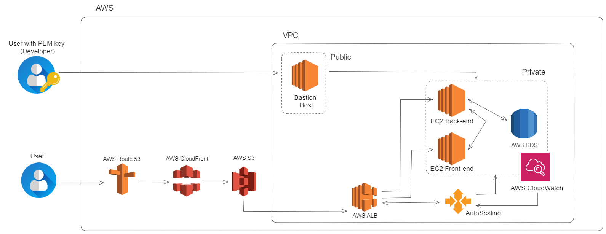

# Arquitetura Corporativa

Com base na arquitetura apresentada acima, é possível ter uma visão geral de como a solução deverá funcionar e todos os serviços utilizados. Da maneira que foi construída, a arquitetura garante que a aplicação seja capaz de atender as principais necessidades corporativas, como **balanceamento de carga, capacidade de failover, elasticidade e avaliação de desempenho**, os quais são mais detalhados ao longo do texto.

Para o **balanceamento de carga**, ou seja, a capacidade de distribuir a demanda em diferentes máquinas afim de melhorar a eficiência da aplicação, empregamos o serviço **AWS Application Load Balancer (ALB)**. Esse componente desempenha um papel crucial ao receber o tráfego de entrada e distribuí-lo entre diferentes máquinas disponíveis. O ALB trabalha em conjunto com o **Autoscaling**, um serviço que gerencia o número de instâncias de acordo com a demanda computacional e cria ou encerra instâncias para manter a eficiência operacional. Além disso, comunica-se com o ALB, informando quais instâncias estão disponíveis para uso, permitindo que o serviço de balanceamento direcione o tráfego de maneira apropriada para todas as máquinas criadas. Essa sinergia não apenas garante uma distribuição eficaz do tráfego, mas também eleva a **disponibilidade** e **confiabilidade** do sistema como um todo. 

Outro ponto alcançado com esse integração entre Amazon ALB com o Autoscaling foi a **capacidade de failover**. Isso significa que, se houver necessidade de mais poder computacional, o Autoscaling cria novas instâncias antes que ocorram falhas. Uma vez criadas, o ALB redireciona o tráfego para essas novas instâncias, assegurando a continuidade adequada da aplicação. Adicionalmente, utilizamos o serviço RDS para hospedar o banco de dados utilizando a funcionalidade multi-az, que replica e sincroniza o banco de dados principal para um segundo banco em outra zona de disponibilidade, o que auxilia na **prevenção contra falhas** e simplifica a recuperação, uma vez que dispomos de um **backup** atualizado.

Outro aspecto crucial é a garantia de **elasticidade** e **escalabilidade** em toda a aplicação, também conquistada utilizando o serviço de Autoscaling da AWS. Com base nas configurações feitas no serviço, o Autoscaling cria novas instâncias para aumentar o poder computacional total ou encerra instâncias ociosas, otimizando o escalonamento horizontal. Os limites máximos de poder computacional que podem ser contratados podem ser estabelecidos para controlar o orçamento, e uma faixa mínima de uso também pode ser definida para que, caso a utilização fique abaixo dessa faixa, instâncias ociosas são encerradas para redução de custos. Essa abordagem garante uma infraestrutura flexível e eficiente, beneficiando tanto a eficiência da aplicação quanto a gestão financeira.

Além desses pontos, visando **avaliar e testar o desempenho** da aplicação, utilizamos os sistemas de monitoramento presentes nos serviços AWS Route 53, AWS ALB e Amazon CLoudWatch. O Route 53 possui verificações das respostas HTTP retornadas pela aplicação, verificando se as respostas são de sucesso, como 200 ou 201, podendo direcionar o tráfego para diferentes destinos dependendo da resposta obtida, sendo útil para testar se um possível erro está no retorno obtido pela aplicação. O ALB é equipado com um monitoramento de saúde integrado que verifica quais instâncias estão saudáveis, garantindo que apenas instâncias em pleno funcionamento recebam tráfego, auxiliando no controle do estado das instâncias, podendo monitorá-las em diferentes testes. Por fim, usamos o CloudWatch para obtermos parâmetros mais próximos sobre o estados de cada máquina, podendo acompanhar pontos específicos como memória, cpu, entre outros.

Por fim, tiveram outros serviços que foram usados com utilidades mais específicas na solução, sendo eles o AWS CloudFront, usado para armazenar informações em cache e melhorar a eficiência na entrega de conteúdo para o usuário final, o AWS S3 (Simple Storage Service), usado para armazenar telas estáticas do front-end e objetos como imagens, áudios, documentos, entre outros e um AWS EC2 como Bastion Host para unificar a máquina de acesso às outras, facilitando o desenvolvimento da aplicação.

Em conclusão, a arquitetura apresentada oferece uma solução abrangente para as necessidades corporativas, incluindo balanceamento de carga, failover, elasticidade e avaliação de desempenho. A combinação de diferentes serviços garante distribuição eficiente de tráfego, alta disponibilidade, capacidade de recuperação e resiliência. Em conjunto, essa arquitetura fornece uma base sólida para sistemas modernos e robustos.

**OBS:** Para entendermos a arquitetura de maneira geral e como a solução deveria funcionar, a desenhamos com todos os serviços que, idealmente, deveriam estar presentes. Porém, por conta de burocracias financeiras, não utilizaremos o serviço **Route 53** para modificarmos o domínio, porém, todos os outros se mantém.