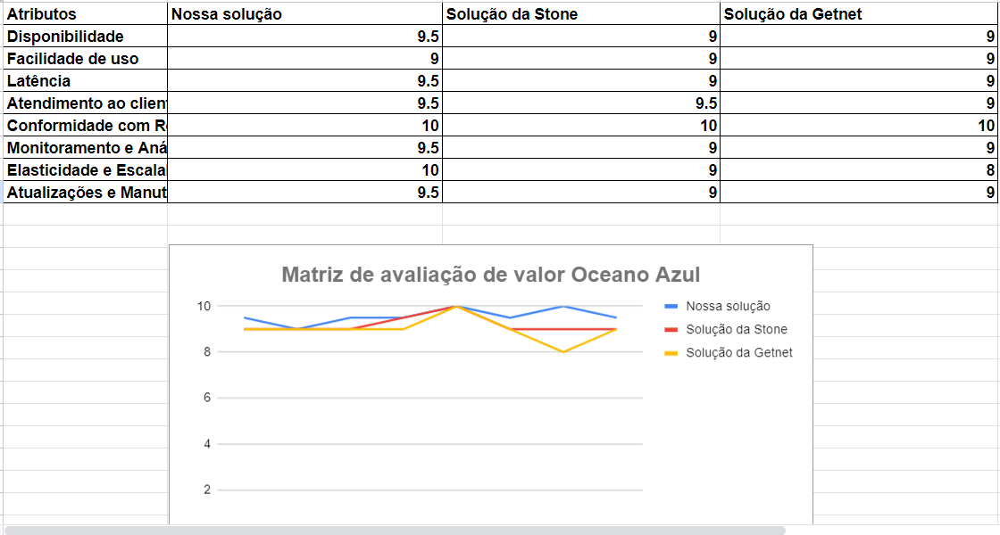
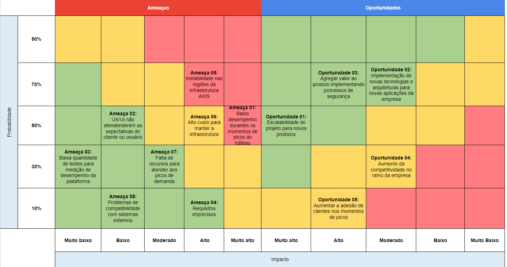

# Entendimento do Negócio

## Matriz de oceano azul
A Matriz de Oceano Azul é um conceito estratégico desenvolvido por _W. Chan Kim_ e _Renée Mauborgne_, apresentado em seu livro "Blue Ocean Strategy" (Estratégia do Oceano Azul), publicado em 2005. Essa matriz é uma ferramenta que ajuda as empresas a explorar novas oportunidades de mercado e a criar espaços de mercado inexplorados, em contraposição aos mercados saturados e altamente competitivos conhecidos como "oceano vermelho".

A ideia central da Matriz de Oceano Azul é que as empresas podem encontrar sucesso duradouro ao criar e inovar em setores que ainda não foram explorados. Em vez de competir ferozmente em mercados existentes (oceano vermelho), as empresas buscam identificar e aproveitar oportunidades em mercados não atendidos ou pouco explorados (oceano azul). Para fazer isso, a matriz enfatiza quatro ações-chave:

1. Eliminar: Identificar os fatores tradicionais do setor que não são essenciais ou valorizados pelos clientes e eliminá-los completamente.

2. Reduzir: Identificar quais fatores podem ser reduzidos abaixo dos padrões da indústria, mas mantendo a qualidade aceitável.

3. Aumentar: Identificar os fatores que os clientes valorizam e aumentar seu foco, a fim de oferecer um nível superior de serviço.

4. Criar: Introduzir fatores ou elementos completamente novos que não existem no mercado atual, proporcionando uma proposta de valor única.

A _Stone co._ é uma empresa que atua no mercado de meios de pagamentos, tecnologia e soluções financeiras. Para realizar a análise de oceano azul e comparar a solução que estamos desenvolvendo com a solução que a empresa já possui, além de olhar para a aplicação do sistema distribuído e escalável do concorrente, é necessário destacar 8 atributos principais que serão utilizados para uma avaliação de como uma nova solução pode impactar não somente na _Stone_ mas também no mercado como um todo. Os 8 atributos escolhidos foram: Disponibilidade, Facilidade de uso, Latência, Atendimento ao cliente, Conformidade com Regulamentações, Monitoramento e Análise, Elasticidade e Escalabilidade e Atualizações e Manutenção Simplificadas. Segue a importância e a razão de cada atributo escolhido:

1. **Disponibilidade**:
Aplicações, principalmente relacionadas às transações financeiras, são críticas e os clientes confiam em sistemas que estejam sempre disponíveis. Interrupções podem resultar em perdas financeiras e comprometer a confiança do cliente. A disponibilidade contínua garante que as transações possam ser realizadas a qualquer momento.

2. **Facilidade de Uso**:
Um sistema de vendas de produtos financeiros deve ser acessível a uma ampla gama de usuários, incluindo aqueles que não têm conhecimentos técnicos avançados. A facilidade de uso garante que clientes e comerciantes possam adotar o sistema sem dificuldades, resultando em adoção mais ampla.

3. **Latência**:
Transferências de dados e transações financeiras exigem resposta rápida para evitar atrasos e proporcionar uma experiência eficiente e semelhante a pagamentos em dinheiro. Uma performance de baixa latência garante que as transações sejam processadas rapidamente, melhorando a satisfação do cliente e a eficiência, caso a latência esteja alta, o cliente pode desistir da compra e o comerciante pode perder a venda.

4. **Atendimento ao Cliente**:
Os clientes precisam de suporte eficaz para resolver problemas, esclarecer dúvidas e obter ajuda em relação aos produtos da empresa. Um bom atendimento ao cliente contribui para a sua confiança, resolve problemas de forma eficaz e ajuda a construir a fidelização do cliente.

5. **Conformidade com Regulamentações**:
O setor de meios de pagamento é altamente regulamentado para garantir a segurança financeira e a proteção dos dados dos clientes. A conformidade com as regulamentações financeiras e de privacidade é essencial para evitar problemas legais e construir confiança dos clientes e usuários com o sistema.

6. **Monitoramento e Análise**:
O monitoramento constante permite identificar problemas, detectar padrões de uso e tomar medidas proativas. Portanto, a análise dos dados coletados auxilia na otimização do sistema, identificação de oportunidades de melhoria e no planejamento de capacidade. Isso é importante para o cliente final da aplicação, pois torna o sistema ainda mais eficiente e confiável.

7. **Elasticidade e Escalabilidade**:
A capacidade de escalar horizontalmente permite que o sistema atenda a picos de demanda sem sobrecarregar a infraestrutura. Assim sendo, a elasticidade garante que o sistema continue funcionando sem problemas mesmo durante aumentos inesperados nas atividades dos usuários do sistema e não comprometa com a qualidade de acesso do site dos clientes em momentos de pico.

8. **Atualizações e Manutenção Simplificadas**:
A capacidade de atualizar e manter o sistema sem grandes interrupções é essencial para melhorias contínuas e correções de problemas. Atualizações e manutenções simplificadas garantem que o sistema permaneça seguro, atualizado e com desempenho otimizado, e melhorando a experiência do cliente e do usuário final da aplicação.

Para que a avaliação seja feita e depois da análise de oceano azul seja possível entender e explorar novas ideias e oportunidades no mercado, é preciso comparar a nossa solução que desenvolveremos e a solução já existente da _Stone_ com uma empresa concorrente. Neste caso foi escolhido a _Getnet_ como empresa a também ser analisada.

**Reduzir:** Latência
 
Buscamos reduzir a latência, visto que com um baixo tempo de resposta, conseguimos uma vantagem competitiva em comparação aos demais concorrentes, visto que a maioria dos clientes não apresentam uma disponibilidade de tempo para ficar esperando diante de um site que demora para carregar. Assim, com uma baixa de latência a _Stone_ teria um ótimo ponto de vantagem assim como no tempo de resposta em ligações telefônicas.

**Eliminar:** Nenhum
 
Não é viável eliminar nenhum dos tópicos abordados, pois buscamos atender todos com excelência, visto que buscamos melhorias para a empresa com a entrega do projeto.

**Aumentar:** 
- **Elasticidade e Escalabilidade:** Esses dois atributos são de extrema importância, visto que com a escalabilidade conseguimos expandir a plataforma para que ela possa suportar uma quantidade de pessoas suficiente sem que trave ou haja queda no sistema, já a elasticidade permite que a escalabilidade seja possível, mas com um controle de gastos, visto que nem sempre a plataforma terá um número de acessos muito elevado.

Partindo do aumento de Escalabilidade, todos os outros fatores devem ser aumentados por consequência:

- **Disponibilidade:** A disponibilidade deve ser aumentada junto com a escalabilidade, visto que não adianta aguentarmos muitos usuários sem ter como atendê-los, dessa forma é necessário ter meios eficientes e velozes para aumentar o atendimento ao cliente sem que afete a qualidade do serviço.
- **Facilidade de Uso:** Ao ter uma aplicação _web_, é de extrema importância que diferentes usuários, com diferentes máquinas e conhecimentos, possam ter a mesma experiência, a qual é sempre almejando a excelência, por isso é necessário que requisitos de _UX_ como: um _site_ responsivo, uma aplicação intuitiva na qual o usuário possa usar sem nenhum tipo de instrução, uma aplicação acessível e inclusiva, entre demais fatores que otimizam a experiencia entre o usuário e a plataforma.
- **Atendimento ao Cliente:** Tendo uma aplicação intuitiva, com muitos acessos e uma equipe de funcionários bem disposta, por consequência o atendimento ao cliente aumenta junto, pois assim os clientes conseguem fazer um auto atendimento apenas com ferramentas disponibilizadas pela própria plataforma, dessa forma mais clientes conseguem ser atendidos e a _Stone_ consegue maximizar as vendas.

Da mesma forma que o aumento da escalabilidade traz benefícios para a empresa, traz junto com ela responsabilidades relacionadas à segurança que precisam de mais atenção, são alguns exemplos:

- **Monitoramento e Análise:**  Com muitas pessoas acessando a plataforma, a probabilidade de alguém mal intencionado aparecer buscando falhas, escalona de forma proporcional, assim é importante estar sempre atento através de monitoramento e análises para verificar se tudo está conforme à _LGPD_, dessa forma é possível um aumento em **Conformidade com Regulamentações**, os usuários conseguem se sentir confortáveis em utilizar a plataforma e a empresa consegue manter um controle de qualidade à medida que a quantidade de acessos vão aumentando.
- **Atualizações e Manutenção Simplificadas:** Por mais que estejamos buscando um aumento na elasticidade, ainda é possível que ocorram falhas de sistema e problemas que precisam ser corrigidos, portanto com o aumento de monitoramento e análise, faz-se então um aumento nas atualizações e manutenções caso necessário, assim os usuários conseguem ter uma experiência cada vez melhor.

**Criar:** Nenhum
 
Estamos trabalhando em um projeto de otimização de uma plataforma já existente, por isso não há necessidade de criar e implementar novas funcionalidades.

Com base nas informações mencionadas anteriormente, foi possível, através de discussões internas do grupo, conceder notas envolvendo os oito atributos da nossa solução, da solução da _Stone_ e da solução da concorrente escolhida, a _Getnet_.

A partir desta imagem, podemos perceber que a nossa solução, a da  _Stone_ e a da  _Getnet_  receberam respectivamente as nota 9 e 10 nos atributos "Facilidade de uso" e "Conformidades com as regulamentações". Isso se deve ao fato de que o sistema da _Stone_ e da _Getnet_ possuem uma boa exepriência do usuário, além de ser um sistema consistente nas necessidades que procura resolver (claramente que sempre é possível ser melhorado), e a nossa solução apenas procura mimetizar esses dois sistemas (principalmente o da _Stone_), por isso que também recebe a mesma nota. Já na parte de "Conformidade com regulamentações", tanto a empresa parceira como a concorrente estão de acordo com os requisitos legais no país e em outros também que operam, recebendo a nota máxima. Novamente, a nossa solução procura seguir os mesmos caminhos e por isso recebe a mesma nota.

Os atributos restantes estão relacionados principalmente à otimização e melhoria, visto que podem ser diminuídos ou aumentados (explicados anteriormente). Este trabalho está relacionado principalmente a um estudo e pesquisa que procura melhorar o funcionamento do sistema nas partes de "Disponibilidade", "Latência", "Monitoramneto e análise", "Elasticidade e Escalabilidade" e "Atualizações e Manutenções simplificadas". A nossa solução procura otimizar e melhorar esses atributos e ofercer uma solução melhor para a _Stone_ para que posteriomente a empresa possa afastar-se da concorrência e ter uma vantagem competitiva no mercado. No atributo "Atendimento ao cliente", a empresa parceira é conhecido por ter atendimentos rápidos e eficientes e sempre mencionam esta característica como identidade da marca, por outro lado a empresa concorrente não especifica esta característica da mesma maneira que a _Stone_, por isso o parceiro recebe uma nota maior que o concorrente e a nossa solução também quer seguir os mesmos caminhos de atendimento ao cliente que a _Stone_ proporciona.

Segue o link da avalição da matriz de oceano azul: https://docs.google.com/spreadsheets/d/16xKnPjyoWivoQ8RRqhgPhgTfnzZJjbNT/edit#gid=260133923

## Value Proposition Canvas

### Customer Jobs
- cj1: Sistema de testes capaz de simular um número alto de requisições por segundo.
- cj2: Testes com baixo custo e sem gerar problemas operacionais.
- cj3 Monitoração com histórico de métricas dos testes.
- cj4: Um sistema de testes global, que funcione para todas as aplicações e contextos da empresa.
- cj5: Aplicações escaláveis e resilientes, que não desperdicem recursos e mantenham o funcionamento com maior número de acessos.
- cj6: Entender a relação da aplicação com a infraestrutura.

### Dores
- p1: Podem haver gargalos na aplicação não cobertos pela solução auto-escalável que prejudicam seu funcionamento e desempenho.
- p2: Alto custo de execução de testes.
- p3: Como fazer testes de forma assertiva para validar o desempenho da aplicação.

### Ganhos
- g1: Maximizar a quantidade de usuários com as requisições atendidas, gerando mais visibilidade para empresa.
- g2: Minimizar a quantidade de recursos ociosos, diminuindo o custo da aplicação.
- g3: Possibilidade de melhorar a infraestrutura ao identificar gargalos.

### Produtos e Serviços
- ps1: Aplicação web de alto desempenho, disponibilidade e escalabilidade e distribuída em múltiplos componentes instalados em nuvem em um cluster de Kubernetes.
- ps2: Sistema de testes utilizando K6.
- ps3: Dashboard no Grafana com indicadores de desempenho e logs de funcionamento da aplicação.

### Aliviadores de Dores
- pr1: Investigar e otimizar partes críticas da aplicação a partir do dashboard do Grafana que possam estar causando gargalos de desempenho.
- pr2: Revisar e ajustar o tamanho e o tipo de instâncias utilizadas na nuvem para reduzir os custos em ambientes de teste e produção.
- pr3: Utilizar ferramentas como K6 para realizar testes de carga e estresse em cenários realistas para validar o desempenho e a capacidade da aplicação sob carga intensa e identificar gargalos e áreas de melhoria.

### Criadores de Ganhos
- gc1: Aplicação escalável que se adapta a quantidade de clientes acessando a aplicação, maximizando o acesso. Além disso, adapta a quantidade de recursos necessários para manter a aplicação funcional, evitando ociosidade.
- gc2: A partir da quantidade de requisições atendidas e falhas, a quantidade de recursos alocados antes, durante e depois dos picos de demanda e logs de erro mostradas no dashboard será possível identificar possíveis gargalos na infraestrutura e melhorá-la.

## Matriz de Risco

### Definição dos riscos - Ameaças

#### Ameaça-001

Para a elaboração da aplicação, serão necessários testes de carga, ou seja, é importante compreender a capacidade de suporte a requisições por segundo.

#### Ameaça-002

A ameaça identificada refere-se à possibilidade de desenvolvimento de uma interface pouco intuitiva e à dificuldade de utilização da plataforma.

#### Ameaça-003

O desenvolvimento da plataforma requer testes para avaliar a capacidade da infraestrutura. A falta de testes adequados pode levar a medições imprecisas do desempenho da plataforma.

#### Ameaça-004

Durante a implementação dos requisitos, é crucial mapear requisitos que não estejam claros ou que possam atrasar devido a dificuldades, afetando a entrega dos mesmos.

#### Ameaça-005

No decorrer do projeto, a AWS será utilizada para fornecer o hardware onde a aplicação será hospedada. Portanto, instabilidades na região da AWS podem impactar a aplicação em desenvolvimento.

#### Ameaça-006

Os serviços da AWS são tarifados com base na demanda e utilização. Assim, a possibilidade de requerer recursos mais caros pode aumentar os custos de manutenção da infraestrutura.

#### Ameaça-007

A falta de recursos para lidar com picos de demanda representa uma ameaça, podendo ser necessário recorrer a máquinas mais robustas, o que implica em maiores gastos financeiros. Além disso, a escolha de máquinas mais acessíveis também demanda recursos intelectuais.

#### Ameaça-008

A falta de compatibilidade se torna uma ameaça caso haja a necessidade de integração com outras plataformas.

### Definição dos ricos - Oportunidades

#### Oportunidade-001

O conhecimento adquirido em infraestrutura pode ser aplicado em outros projetos com alta demanda por requisições.

#### Oportunidade-002

Explorar novas tecnologias e arquiteturas de sistemas para outras áreas da empresa que utilizam plataformas web.

#### Oportunidade-003

Implementar medidas de segurança na infraestrutura e na plataforma web garantirá o respeito à privacidade da empresa e dos usuários, agregando valor ao produto.

#### Oportunidade-004

A capacidade de lidar com picos de demanda possibilita que a empresa aproveite oportunidades de mercado sazonais, eventos especiais ou lançamentos de produtos, aumentando sua vantagem competitiva.

#### Oportunidade-005

Ao aumentar a visibilidade e atrair maior número de visitantes, a empresa poderá conquistar um maior número de clientes.

## Análise Financeira do Projeto: Visão Geral e Objetivos
A análise financeira de um projeto é uma ferramenta essencial para avaliar a viabilidade, rentabilidade e riscos associados a um empreendimento. Nesta análise, abordamos os principais aspectos financeiros relacionados ao projeto, incluindo os custos. O objetivo é fornecer informações detalhadas e precisas para auxiliar na tomada de decisões e na gestão eficiente dos recursos disponíveis.

A análise financeira desenvolvida para este projeto pode ser dividida em 2 partes principais: investimentos para o desenvolvimento da aplicação e investimentos para a sua manutenção.

Iniciando pelo escopo do desenvolvimento, abordamos 8 conceitos principais, incluindo:

1. **Duração do projeto** - O tempo de desenvolvimento da solução, dividido em 5 sprints (10 semanas).
2. **Número de integrantes no time** - O número de gerentes de projetos júnior na equipe.
3. **Disponibilidade em caixa da empresa para o custeio do projeto** - Valor que o cliente está disposto a investir no projeto. Até o momento, não nos foi disponibilizado nenhum valor.
4. **Salário de cada gerente de produto júnior** - Baseado na média salarial de um gerente de projetos júnior, conforme informações disponíveis em https://www.glassdoor.com.br/Sal%C3%A1rios/gerente-de-projetos-j%C3%BAnior-sal%C3%A1rio-SRCH_KO0,26.htm
5. **Custos relacionados à manutenção do projeto** - Neste caso, o custo para manutenção é composto pelos custos cobrados pela AWS sobre a alocação da infraestrutura (armazenamento, poder computacional, etc.) em nuvem utilizada no projeto.
6. **Horas totais** - Considerando o plano da faculdade para este módulo e descontando os dias de encontros com o cliente e as Sprints Planning, temos 232h 30min disponíveis para a realização do estudo e desenvolvimento do projeto.
7. **Remuneração por hora** - Com base no salário total de cada desenvolvedor e na quantidade total de horas trabalhadas, a remuneração por hora para cada gerente de projetos júnior é de R$ 53,72.
8. **Custo de desenvolvimento do projeto** - A soma de todos os custos com salários resulta em um custo total de R$ 91.142,10.

Tendo em vista que a aplicação será disponibilizada em nuvem, haverá gastos relacionados à manutenção dos serviços contratados da AWS. Para calcularmos a estimativa desses custos em 12 meses, utilizamos a pricing calculator (calculadora de precificação) fornecida pela AWS. Na calculadora, é necessário selecionarmos qual(is) serviço(s) iremos usar, sendo duas instâncias de AWS EC2, uma usada para hospedar o front-end e outra para o back-end, uma instância de AWS RDS for MySQL para hospedar o banco de dados criado em MySQL, um cluster do serviço AWS EKS, usado para criar e visualizar os clusters da aplicação, um ambiente privado usando o AWS VPC com 3 conexões site-to-site e 2 associações de sub-rede para podermos controlar os acessos da rede pública à nossa aplicação e, por fim, utilizaremos o Amazon Route 53 para controlarmos o domínio utilizado pela aplicação e verificações iniciais de DNS. Porém, como estamos em fase inicial de desenvolvimento, não é possível saber com exatidão qual tipo de instâncias iremos usar definitivamente. Portanto, iremos selecionar os tipos que, segundo nossas previsões, serão suficientes para suprir nossas necessidades com o mínimo de recursos ociosos.

Para nossos objetivos, precisaremos de instâncias que suportem uma aplicação web simples, mas que, ao mesmo tempo, aguentem muitos acessos. Sendo assim, prevemos que as instâncias T3 serão suficientes, visto que são recomendadas para aplicações com picos temporários de uso, assim como a em desenvolvimento. Em relação a qual tipo de T3, prevemos que o T3.small atenda nossos requisitos.

Além disso, o tipo de pagamento também afeta o custo final. Temos a opção de pagar sob demanda, com um custo mensual conforme usamos, ou com um plano de reserva, no qual se define um tempo de 1 ou 3 anos em que a instância será usada. Nesse modelo, há um desconto dado pela AWS sobre o preço final. Como não é certo qual instância usaremos e por quanto tempo, escolhemos o modelo de pagamento sob demanda.

Por fim, acreditamos que um RDS no modelo db.t3.micro seja suficiente, visto que prevemos que nosso banco de dados não será muito extenso e complexo. Após essas definições, temos um custo anual de manutenção da infraestrutura estimado em 9.581,76 USD.

A seguir, apresentamos uma tabela resumida com os principais aspectos financeiros abordados na análise financeira do projeto. A tabela inclui informações detalhadas sobre custos, salários e horas trabalhadas, fornecendo uma visão geral dos recursos necessários para o projeto.

### Tabela Resumida da Análise Financeira do Projeto
| Item                                    | Descrição                                        | Valor         |
| --------------------------------------- | ------------------------------------------------ | ------------- |
| Duração do projeto                      | 5 sprints (10 semanas)                           |               |
| Dólar                                   | Cotação do dolár usada nas conversões            | R$ 4,90       |
| Número de integrantes no time           | 7 gerentes de projetos júnior                    |               |
| Salário mensal de cada gerente (júnior) | Média salarial do mercado                        | R$ 6.245,00   |
| Salário total de cada gerente (2 meses) | Salário mensal x 2 meses                         | R$ 12.490,00  |
| Horas totais disponíveis                | 232h 30min                                       |               |
| Remuneração por hora                    | Salário total / horas totais                     | R$ 53,72      |
| Custo de desenvolvimento do projeto     | Salários + horas trabalhadas                     | R$ 91.142,10  |
| Custo mensal EC2's                      | Custo mensal dos dois EC2 contratados            | USD 30,37     |
| Custo anual EC2's                       | Custo mensal dos dois EC2 contratados x 12 meses | USD 364,44    |
| Custo mensal RDS                        | Custo mensal do RDS contratado                   | USD 36,61     |
| Custo anual RDS                         | Custo mensal do RDS x 12 meses                   | USD 439,32    |
| Custo mensal EKS                        | Custo mensal do EKS contratado                   | USD 73,00     |
| Custo anual EKS                         | Custo mensal do EKS x 12 meses                   | USD 876,00    |
| Custo mensal VPC                        | Custo mensal do VPC contratado                   | USD 530,50    |
| Custo anual VPC                         | Custo mensal do VPC x 12 meses                   | USD 6.366,00  |
| Custo mensal Route 53                   | Custo mensal do Route 53 contratado              | USD 128,00    |
| Custo anual Route 53                    | Custo mensal do Route 53 x 12 meses              | USD 1.536,00  |
| Custo anual de manutenção da aplicação  | Soma de todos os custos anuais de manutenção     | USD 9.581,76  |
| Custo anual de manutenção em reais      | Custo anual de manutenção x Dólar                | R$ 46.950,62  |
| Custo total do projeto                  | Custo desenvolvimento + custo manutenção         | R$ 138.092,72 |

#### Considerações Adicionais
É importante ressaltar que a receita gerada pelo projeto em um ano não foi estimada nesta análise, pois está fora do escopo do projeto e depende de fatores externos, como a quantidade de acessos que serão convertidos em vendas. Recomendamos uma análise adicional para estimar a receita gerada pelo projeto e avaliar seu impacto financeiro no longo prazo.

Além disso, a disponibilidade em caixa da empresa para o custeio do projeto ainda não foi fornecida pela Stone. Essa informação é crucial para determinar a viabilidade do projeto e garantir que os recursos financeiros necessários estejam disponíveis.

Por fim, é importante notar que a análise financeira é somente uma estimativa de gastos, necessária para avaliar a viabilidade do projeto.