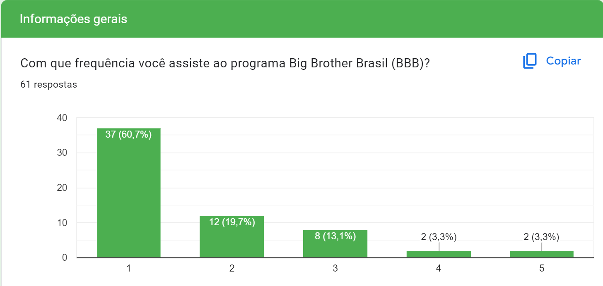

# Entendimento do usuário

## Introdução

### Objetivos

A presente pesquisa tem como fim entender mais profundamente o usuário da solução a ser desenvolvida pelo grupo em questão, para que o MVP seja confeccionado com foco na resolução de dores, problemas e comportamentos mapeados na análise dos resultados. Cabe ressaltar que, no momento anterior ao contato via pesquisa qualiquantitativa com o usuário, foi realizada uma sessão de perguntas e respostas com os desenvolvedores da empresa parceira, para que uma imersão preliminar fosse realizada, com o intuito de entender limitações técnicas, abordagens já utilizadas e requisitos fundamentais para o desenvolvimento do projeto, em adição a documentos já disponibilizados, como o _TAPI_. Isso porque o objetivo da pesquisa é corresponder ao máximo às expectativas, tanto do cliente, quanto dos usuários da aplicação, então o procedimento descrito nesse entendimento do usuário é de suma importância para compor a solução que mais se adequa aos requisitos.    

## Relatório

A pesquisa exploratória foi a ação inicial do processo de ideação da solução, em que o grupo de desenvolvimento se valeu do documento oficial disponibilizado pelo parceiro de projeto (_TAPI_) e pela apresentação da empresa no Onboarding, elencando, em momento posterior, as principais dúvidas e lacunas de informações que limitavam a concepção inicial do projeto e não permitiam que as expectativas do cliente fossem captadas em plenitude. Assim, confeccionamos perguntas e as realizamos em momento oportuno, o que possibilitou a consolidação dos objetivos do projeto, assim como suas limitações e desafios. Indo além, foi feito, com os dados obtidos, perguntas e validações de hipóteses estratégicas com os usuários, sendo essa a pesquisa qualiquantitativa. Com os resultados condensados, o _desk research_ foi confeccionado para mapear visualmente as principais informações e direcionamentos do projeto, sendo possível, assim, dar início a codificação da solução com maior precisão e clareza.

## Sumário Desk Research

Como meio de pesquisa secundária, o _desk research_ necessita de informações já consolidadas para organizá-las de forma específica. Sendo assim, a coleta dos dados se deu por meio da análise do documento _TAPI_, da entrevista com o parceiro e da pesquisa qualiquantitativa. Os critérios de seleção de informações foram as perguntas presentes no template de figuras, que foi utilizado para organizar os conhecimentos e padronizar as indagações, sintetizando dados essenciais.
A sumarização com as principais informações podem ser encontradas abaixo:
   

## Pesquisa qualiquantitativa

A elaboração da pesquisa se deu após a entrevista com a empresa parceira, conforme explicação prévia, utilizando a metodologia bola de neve, em que um participante é incentivado a compartilhar a pesquisa com mais 3 pessoas de seu círculo próximo (desde que se enquadre no público alvo), de forma que os dados sejam coletados da forma mais rápida possível, o que é pertinente dada a restrição de tempo para obtenção das informações. A pesquisa foi divida em três partes: dados demográficos, para levantamentos estatísticos, informações gerais, para aprofundamento na percepção da marca e reconhecimento dos melhores veículos para propaganda, e, por fim, análise comportamental, para mapeamento de sentimentos em situações críticas, como o projeto propõe.

A fim de evitar vieses, já que a apresentação do parceiro de projeto enfatizou que o público alvo de sua aplicação é qualquer brasileiro que utilize _internet_ ou assista televisão, a pesquisa qualiquantitativa deveria preservar essa distribuição etária abrangente, então ela foi distribuída entre os possíveis usuários com as mais diversas idades, o que foi viável uma vez que o pesquisador responsável procurou em seu círculo social pessoas desde 16 até 64 anos, muitas de forma presencial, outras somente pela rede "_WhatsApp_", o que, de forma concomitante, contribuiu para selecionar usuários com os mais distintos ofícios, como queríamos preservar. Essa ampla distribuição é possível verificar nos gráficos abaixo, em que 61 pessoas foram entrevistadas:

As perguntas, assim como o compilado das respostas, estão evidenciados a seguir:

Cabe ressaltar que 1 - nunca, 2 - raramente, 3 - às vezes, 4 - frequentemnte, 5 - sempre

Embora muitas pessoas não assistam ao BBB, as que assistem visitam sites dos anúncios publicitários, o que é de grande valor ao parceiro de projeto, uma vez que nem todos os brasileiros veem o programa, mas os que assistem tendem a seguir a propaganda, reforçando que as inserções publicitárias pode surtir grande efeito.

O que demonstra que a Stone está entre as 4 marcas mais conhecidas ou utilizadas na última semana.

O que indica que o meio que mais agrega novas marcas de valor para os entrevistados é o _Instagram_ e o _Facebook_ é o que menos agrega, sendo a ordem _Instagram_, _YouTube_, _TV_ e _Facebook_ o _ranking_ dos melhores meios.

OBS: a 2ª opção, com 21 votos, é essa: "Marca com valores parecidos aos meus", enquanto as com 1 voto cada foram inserções dos entrevistados pela opção "outras".
O maior fator de atração em uma inserção publicitária é um produto inovador (60% concordam), até mais do que uma oferta atrativa financeiramente, como imagina o senso comum.

A maior parte do conjunto amostral não é tão imediatista a ponto de exigir que o site abra com menos de 5 segundos, permitindo com que não seja nocivo demorar até, no máximo, 10 segundos para mostrar as informações, dando espaço para um atendimento gradativo das requisições em momento de pico de acesso.

Sendo perceptível a necessidade de um feedback visual para situar o usuário de um site, a fim de que ele fique menos estressado e, com isso, evite com que esse sentimento negativo seja associado a marca

Aqui reside a conclusão principal da pesquisa e o que mais agregou valor para o desenvolvimento da solução. De acordo com a amostra, é muito pior para o usuário entrar em um site e ele travar a cada clique do que não o abrir ou exibir uma mensagem de erro, pedindo para tentar entrar novamente mais tarde. Isso é fundamental para evitar que a pessoa tenha uma visão negativa da marca, sendo possível tomar medidas paleativas, como exibir a mensagem de erro em caso de acessos maiores do que o suportado.

O que demonstra que a chance do entrevistador acessar novamente o site da propaganda depende do conteúdo e do interesse individual em cada produto, uma vez que a distribuição das respostas praticamente seguiu a distribuição normal.

## Conclusão

Tendo como base as informações apresentadas, pode-se concluir que o processo de imersão foi bem sucedido e conseguiu fazer com que o grupo tivesse insumos mais claros para começar a desenvolver o protótipo da solução. Cabe ressaltar um "_insight_" muito agregador que não estava previamente mapeado: por conta das respostas para a pergunta "como você se sente quando está navegando por um site e..." foi possível analisar que, de acordo com os dados, as pessoas preferem que a página não abra do que ela carregue, mas, a cada clique, ela trave, como é visível nos contrastantes 45% que ficam muito irritados com o travamento recorrente com os 8% e 16% que ficam muito irritados com a mensagem de erro ou com 10 segundos sem aparecer informação, respectivamente. Isso é de muito valor, já que, a partir dessa conclusão, o grupo pode desevolver um mecanismo que coloque uma tela com a mensagem "ocorreu um erro, volte mais tarde" em caso de acessos maiores do que o sistema comporta, para evitar maiores transtornos ao usuário, sendo essa a melhor medida paleativa.
Também foi possível compreender os principais sentimentos negativos associados a uma aplicação, e os melhores meios de comunicar uma progaganda, sendo de interessante análise para entendimento do usuário, como proposto pelo presente artefato.

