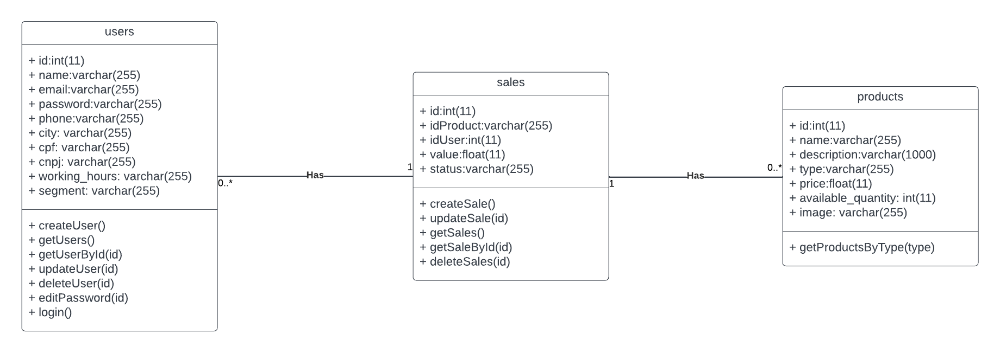

# Modelagem e Implementação

## Diagrama e descrições dos casos de uso
O diagrama de caso de uso resume os detalhes dos usuários do seu sistema (também conhecidos como atores) e as interações deles com o sistema.

Os principais componentes são:  
- Caso de uso: formato oval na horizontal e que representam os diferentes usos que um usuário pode ter.

- Atores: bonecos palito, representando as pessoas que realmente implementam os casos de uso.

- Associações: uma linha entre atores e casos de uso. Nos diagramas complexos, é importante saber quais atores estão associados a quais casos de uso.

- Caixa de limite do sistema: caixa que define um escopo do sistema para os casos de uso.

### Caso 1: Se cadastar na plataforma
**Escopo:** Aplicação NimBBBus. 
**Nível:** Objetivo do usuário. 
**Atores:** Usuário. 
**Interessados e interesses** 
- Usuário: deseja se cadastrar na plataforma para usufruir de suas funcionalidades, como comprar uma maquininha para seu negócio.
- Empresa: deseja aumentar seu número de usuários para aumentar suas vendas.
 

**Pré-condições:** Não se aplica. 
**Pós-condições:** Cadastro do usuário realizado com sucesso. 
**Fluxo Básico:** 
1. Usuário seleciona o botão "Seja Nimbus" da Landing Page.
2. Usuário preenche o formulário de cadastro adicionando nome, e-mail, senha, telefone, cidade, CPF ou CNPJ, horário de funcionamento do estabelecimento e segmento de mercado.
3. Usuário clica no botão "Cadastar".
4. Cliente cadastrado com sucesso.
 

**Fluxos alternativos:**  

1a. Usuário clica em outros botões ao longo da Landing Page.

1. Sistema redireciona sempre para a mesma tela de cadastro.
2. Fluxo segue como o esperado.
   
2a. Campo inválido

1. Sistema avisa o erro e rejeita a entrada.
2. Usuário responde ao erro inserindo um valor válido.

2b. Campo não preenchido

1. Sistema avisa o erro e rejeita a entrada.
2. Usuário preenche todos os campos.

**Requisitos especiais:** 
- O sistema deve ter disponibilidade de 99,95%.
- O cadastro deve poder ser feito via celulares e tablets por meio de responsividade.

**Lista de variantes:**  Não se aplica. 
**Frequência de ocorrência:** Apenas na primeira interação do usuário com a plataforma. 
**Problemas em aberto:** Não se aplica.

### Caso 2: Atualizar as informações da conta
**Escopo:** Aplicação NimBBBus. 
**Nível:** Objetivo do usuário. 
**Atores:** Usuário. 
**Interessados e interesses:**
- Usuário: Deseja atualizar suas informações da conta caso se alterem ao longo do uso do sistema.
- Empresa: Deseja ter os dados de seus clientes sempre atualizados para promover melhor experiência.

**Pré-condições:** Usuário deve estar autenticado. Usuário deve estar ná página de perfil. 
**Pós-condições:** Informações na tela de perfil foram atualizadas com sucesso. 
**Fluxo Básico:**  
1. Usuário clica no botão para editar conta.
2. Usuário edita as informações que deseja atualizar.
3. Usuário clica no botão "Editar".
4. Informações atualizadas com sucesso.

**Fluxos alternativos:**  
1a. Usuário deseja cancelar a ação de editar.

1. Usuário clica no "X" no canto superior direito do modal.
2. Modal é fechado e o usuário retorna para a página de perfil.
   
2a. Campo inválido

1. Sistema avisa o erro e rejeita a entrada.
2. Usuário responde ao erro inserindo um valor válido.

2b. Campo não preenchido

1. Sistema avisa o erro e rejeita a entrada.
2. Usuário preenche todos os campos.

**Requisitos especiais:** 
- O sistema deve ter disponibilidade de 99,95%.
- A edição deve poder ser feita via celulares e tablets por meio de responsividade.

**Lista de variantes:**  Não se aplica. 
**Frequência de ocorrência:** Eventual. 
**Problemas em aberto:** Não se aplica. 

### Caso 3: Deletar Conta
**Escopo:** Aplicação NimBBBus. 
**Nível:** Objetivo do usuário. 
**Atores:** Usuário. 
**Interessados e interesses**  
**Pré-condições:** Usuário deve estar autenticado. Usuário deve estar ná página de perfil. 
**Pós-condições:** Conta é deletada com sucesso. Usuário é redirecionado para a Landing Page da plataforma 
**Fluxo Básico:**  
1. Usuário clica no botão de deletar a conta.
2. Usuário confirma se quer realmente deletar a conta.
3. Conta deletada com sucesso.

**Fluxos alternativos:**  
2a. Usuário não quer mais deletar a conta.

1. Usuário seleciona a opção "Não".
2. Usuário volta para a tela de perfil.

**Requisitos especiais:** 
- O sistema deve ter disponibilidade de 99,95%.
- O cancelamento deve poder ser feito via celulares e tablets por meio de responsividade.

**Lista de variantes:**  Não se aplica. 
**Frequência de ocorrência:** Eventual. 
**Problemas em aberto:**  
- Por que o usuário deseja cancelar a conta?

    - Adicionar um questionário para saber os motivos do usuário.

### Caso 4: Comprar um produto
**Escopo:** Aplicação NimBBBus. 
**Nível:** Objetivo do usuário. 
**Atores:** Usuário. 
**Interessados e interesses:**  
- Usuário: Deseja realizar a compra de uma maquininha para seus negócios.
- Empresa: Deseja vender seus produtos para os usuários.

**Pré-condições:** Usuário deve estar autenticado e ter escolhido uma categoria. 
**Pós-condições:** Compra realizada com sucesso. Usuário retorna para a página de categorias. 
**Fluxo Básico:**  
1. Usuário escolhe os produtos que deseja comprar.
2. Usuário preenche o formulário de endereço para entrega.
3. Usuário revisa as informações do pedido.
4. Usuário adiciona informações de pagamento.
5. Usuário realiza a compra.

**Fluxos alternativos:**  
1-4a. Usuário deseja voltar para uma etapa anterior.

1. Usuário clica na seção que deseja retorna no menu no centro e em cima da página.
2. Usuário retorna para a seção desejada.

1b. Usuário deseja retirar um produto adicionado.

1. Usuário clica no "-" do produto e este é retirado do pedido.
2. O preço da compra é atualizado de acordo com os produtos ainda escolhidos.

1c. Usuário deseja adicionar um produto.

1. Usuário clica no "+" do produto e este é adicionado ao pedido.
2. O preço da compra é atualizado de acordo com os produtos escolhidos.

2b e 4b. Campo inválido

1. Sistema avisa o erro e rejeita a entrada.
2. Usuário responde ao erro inserindo um valor válido.

2c e 4c. Campo não preenchido

1. Sistema avisa o erro e rejeita a entrada.
2. Usuário preenche todos os campos.

3b. Usuário deseja editar o endereço.

1. Na seção de endereço o usuário clica na opção de editar.
2. O sistema redireciona para a página de endereço para entrega.
3. Usuário atualiza as informações.
4. Usuário retorna para a página de resumo com as informações de endereço atualizadas.

3c. Usuário deseja editar os produtos escolhidos.

1. Na seção de pedido o usuário clica na opção de editar.
2. O sistema redireciona para a página de maquininhas.
3. Usuário atualiza o pedido.
4. Usuário retorna para a página de resumo com as informações de pedido atualizadas.

3d. Usuário deseja cancelar a compra.

1. Usuário clica no botão "Cancelar Pedido".
2. Usuário é redirecionado para a página de categorias e o pedido é cancelado.

**Requisitos especiais:** 
- O sistema deve ter disponibilidade de 99,95%.
- A compra deve poder ser feita via celulares e tablets por meio de responsividade.
- O sistema deve permitir ao usuário realizar uma compra com 5 cliques.

**Lista de variantes:**  Não se aplica. 
**Frequência de ocorrência:** Poderia ser quase contínuo. 
**Problemas em aberto:**  
- Como o usuário irá acompanhar sua compra após a confirmação?
    
    - Conversas com o parceiro seriam úteis para entender como deve ser feito esse acompanhamento.

### Caso 5: Fazer login na plataforma
**Escopo:** Aplicação NimBBBus. 
**Nível:** Subfunção. 
**Atores:** Usuário. 
**Interessados e interesses** 
- Usuário: deseja se logar na plataforma para comprar maquininhas para seu negócio.
- Empresa: deseja permitir que apenas usuários cadastados possam realizar compras na plataforma.
 

**Pré-condições:** Usuário deve estar cadastrado na plataforma. 
**Pós-condições:** Login realizado com sucesso. Usuário é redirecionado para a página de categorias. 
**Fluxo Básico:** 
1. Usuário adiciona e-mail e senha.
2. Usuário clica no botão "Entrar".
3. Login realizado com sucesso e usuário é redirecionado para a página de categorias.
 

**Fluxos alternativos:**  
1a. Campo inválido

1. Sistema avisa o erro e rejeita a entrada.
2. Usuário responde ao erro inserindo um valor válido.

1b. Campo não preenchido

1. Sistema avisa o erro e rejeita a entrada.
2. Usuário preenche todos os campos.

1c. Usuário inválido

1. Sistema avisa o erro e rejeita a entrada.
2. Usuário clica no link "Clique aqui" para realizar cadastro ou checa se preencheu as informações corretamente.

**Requisitos especiais:** 
- O sistema deve ter disponibilidade de 99,95%.
- O login deve poder ser feito via celulares e tablets por meio de responsividade.

**Lista de variantes:** Não se aplica. 
**Frequência de ocorrência:** Poderia ser quase contínuo. 
**Problemas em aberto:** 
- E se o usuário desejar trocar ou esqueceu a senha?
    - Deve ser adicionada uma página de "Esqueci minha senha" caso o usuário deseje trocá-la.

## Diagrama de Classes UML

Um diagrama de classe mapeia de forma clara a estrutura de um determinado software ao modelar suas classes, seus atributos, operações e relações entre objetos.

No diagrama em questão, a análise das informações provenientes do banco de dados e da aplicação WEB desempenha um papel crucial. As classes, que correspondem às tabelas do banco de dados, são identificadas e representadas de forma apropriada. Os atributos, que se alinham com as colunas dessas tabelas, são detalhadamente especificados para mostrar quais dados cada classe contém.

Além disso, os métodos das classes são mapeados através da manipulação dos dados pelo backend da aplicação. Esses métodos representam as ações que podem ser realizadas sobre as classes, como inserir, atualizar ou consultar informações. Essa análise minuciosa ajuda a definir as funcionalidades do software e a garantir que ele atenda aos requisitos do usuário de forma eficaz.

### Descrição das classes

#### Classe: users

Uma classe chamada "users" representa entidades de usuário na loja NimBBBus, relacionada a autenticação e gerenciamento de informações de usuário. Aqui estão os atributos e métodos associados a essa classe:

*Atributos:*

id (int(11)): Este atributo representa um identificador único para cada usuário no sistema, sendo um número inteiro.

name (varchar(255)): O atributo "name" armazena o nome do usuário, com um limite de 255 caracteres, usado para identificar o usuário.

email (varchar(255)): O atributo "email" armazena o endereço de e-mail do usuário, também com um limite de 255 caracteres. É usado para comunicações e identificação exclusiva do usuário.

password (varchar(255)): O atributo "password" armazena a senha do usuário, com um limite de 255 caracteres.

phone (varchar(255)): O atributo "phone" armazena o número de telefone do usuário, com um limite de 255 caracteres, o que pode ser útil para entrar em contato com o usuário.

city (varchar(255)): O atributo "city" armazena a cidade de residência do usuário, com um limite de 255 caracteres, usado para informações geográficas para realizar a entrega dos produtos.

cpf (varchar(255)): O atributo "cpf" armazena o número do Cadastro de Pessoas Físicas (CPF) do usuário, com um limite de 255 caracteres.

cnpj (varchar(255)): O atributo "cnpj" armazena o número do Cadastro Nacional da Pessoa Jurídica (CNPJ) do usuário, com um limite de 255 caracteres.

working_hours (varchar(255)): O atributo "working_hours" armazena as horas de trabalho do usuário, com um limite de 255 caracteres.

segment (varchar(255)): O atributo "segment" armazena o segmento ao qual o usuário está associado, com um limite de 255 caracteres.

*Métodos:*

createUser(): O método "createUser" é usado para criar um novo registro de usuário no sistema, preenchendo os atributos da classe com as informações fornecidas.

getUsers(): O método "getUsers" é usado para recuperar a lista de todos os usuários cadastrados no sistema.

getUserById(id): O método "getUserById" permite a recuperação de informações de um usuário específico com base em seu ID.

updateUser(id): O método "updateUser" é usado para atualizar as informações de um usuário existente com base no ID fornecido.

deleteUser(id): O método "deleteUser" é usado para excluir um usuário com base em seu ID, removendo-o do sistema.

editPassword(id): O método "editPassword" é usado para alterar a senha de um usuário com base em seu ID.

login(): O método "login" é responsável por autenticar um usuário com base no email e senha fornecidos, permitindo o acesso ao sistema.

#### Classe: produtos

A classe "produtos" representa produtos da loja Nimbbus, que no contexto atual são as maquininhas. Aqui estão os atributos e métodos associados a essa classe:

*Atributos:*

id (int(11)): Este atributo representa um identificador único para cada produto no sistema, sendo um número inteiro.

name (varchar(255)): O atributo "name" armazena o nome do produto, com um limite de 255 caracteres. Isso identifica o produto.

description (varchar(1000)): O atributo "description" armazena uma breve descrição do produto, com um limite de 1000 caracteres. Isso fornece informações adicionais sobre o produto.

type (varchar(255)): O atributo "type" armazena o tipo ou categoria do produto, com um limite de 255 caracteres. Isso pode ser usado para agrupar produtos semelhantes juntos, como o tipo das maquininhas.

price (float): O atributo "price" armazena o preço do produto, representado como um número de ponto flutuante (float).

available_quantity (int): O atributo "available_quantity" armazena a quantidade disponível do produto em estoque, sendo um número inteiro.

image (varchar(255)): O atributo "image" armazena uma URL ou caminho para uma imagem do produto, com um limite de 255 caracteres. Isso é usado para exibir uma imagem representativa do produto.

*Métodos:*

getProductsByType(type): O método "getProductsByType" recebe como parâmetro o tipo de produto desejado e retorna uma lista de produtos desse tipo. Isso permite ao sistema buscar produtos específicos com base na categoria.

#### Classe: vendas

A classe "vendas" representa vendas ou transações da loja NimBBBus. Aqui estão os atributos e métodos associados a essa classe:

*Atributos:*

id (int(11)): Este atributo representa um identificador único para cada venda no sistema, sendo um número inteiro.

idProduct (varchar(255)): O atributo "idProduct" armazena o identificador do produto vendido, que está relacionado à classe Product.

idUser (int(11)): O atributo "idUser" armazena o identificador do usuário que fez a venda. Esse ID está relacionado à classe User.

value (float): O atributo "value" armazena o valor monetário da venda, representado como um número de ponto flutuante (float).

status (varchar(255)): O atributo "status" armazena o status da venda, com um limite de 255 caracteres. Esse atributo pode ser usado para indicar o status da transação, como "pendente", "concluída", "cancelada", entre outros.

*Métodos:*

createSale(): O método "createSale" é usado para criar uma nova entrada de venda no sistema quando o usuário for comprar a maquininha, preenchendo os atributos da classe com as informações fornecidas, como o produto vendido, o usuário que fez a compra, o valor e o status.

updateSale(id): O método "updateSale" permite a atualização das informações de uma venda existente com base no ID fornecido. Isso pode incluir a alteração do status da venda ou a atualização do valor, por exemplo.

getSales(): O método "getSales" é usado para recuperar a lista de todas as vendas registradas no sistema. Isso permite uma visão geral de todas as transações de vendas.

getSaleById(id): O método "getSaleById" permite a recuperação de informações de uma venda específica com base no ID fornecido. Isso é útil para obter detalhes específicos sobre uma transação em particular.

deleteSales(id): O método "deleteSales" é usado para excluir uma venda com base no ID fornecido, removendo-a do sistema. Isso pode ser útil em casos de cancelamento de vendas.

## Diagramas de Sequência UML

Os diagramas de sequência são utilizados para identificar e mostrar os comportamentos interativos de um sistema e descrever como e em que ordem os objetos, assim como o ator, interagem.

Nos diagramas de sequência descritos a seguir, existem 4 notações importantes para seu entendimento:

#### Atores

São usados para representar a linha de vida que um ator específico terá no sistema, como por exemplo, as interações do **usuário final**, definindo quais delas partirão ou acabarão interagindo com o ator definido.

#### Figuras

São usadas para representar os diferentes objetos em um sistema que podem ter interações diretas ou que são afetados por interações com o ator definido.

#### Linhas de vida

São usadas para definir uma linha em cada figura e ator, representando quais interações originam, passam ou acabam neles.

#### Mensagens

As mensagens representam as etapas do processo descrito no diagrama, sendo cada uma delas uma interação entre o sistema. As mensagens podem ser de 2 tipos:
- **Assíncronas** (linhas tracejadas), as quais acontecem automaticamente, independentemente da resposta do sistema às etapas anteriores.
- **Síncronas** (linhas contínuas), as quais o sistema só dará seguimento à sequência caso sejam corretamente processadas.

Nessa seção são representados em diagramas de sequências os últimos requisitos adicionados pelo cliente, sendo eles:

### Simulação de produtos:
  
  

 Esse diagrama representa o processo que o usuário deve fazer para ter acesso a todos os produtos oferecidos. Primeiramente, é necessário que o usuário esteja conectado à sua conta, portanto, precisa realizar login. Caso ainda não tenha criado uma conta na plataforma, é necessário realizar cadastro, o qual pode ser feito com base no diagrama apresentado posteriormente nessa seção. Após conectar à sua conta, ao selecionar a opção "Planos", o usuário é redirecionado à página onde estão presentes todas as opções de produtos, possibilitando uma fácil visualização das maquininhas por parte do usuário final.

### Possibilidade de cadastro:
  
 

 Esse diagrama representa o processo de cadastramento de novos usuários na aplicação. Acessando a página inicial da plataforma, o usuário acessa a área de cadastro e preenche os dados necessários, sendo eles: Nome completo, Celular com DDD, E-mail, CPF do usuário, Segmento da empresa, entre outras informações importantes, e, por fim, cria uma senha que será utilizada para acessar a conta em logins posteriores. Preenchidos, os dados são armazenados no banco de dados da aplicação e o novo usuário está corretamente cadastrado.

### Autorização de clientes antigos:

 

 Esse diagrama representa o processo que usuários já previamente cadastrados podem realizar para entrarem em sua conta na plataforma. Acessando a página inicial, o usuário acessa a área de login e preenche os campos com informações de e-mail e senha. Em seguida, o sistema verifica se o e-mail inserido está presente no banco de dados e, caso esteja, se as senhas são as mesmas. Uma vez que as informações estejam corretas, o usuário volta para a página inicial, agora logado em sua conta. Caso em algum momento da verificação das informações haja um erro, é apontado para o usuário que os dados estão incorretos, sugerindo que tente novamente.
 

## Diagrama de Implantação UML

Um diagrama de implantação é um tipo de diagrama UML (Unified Modeling Language) que descreve a disposição física e a configuração de componentes de software em um sistema distribuído ou em uma infraestrutura de hardware. Ele é usado para representar como os diversos elementos de um sistema interagem e são distribuídos em hardware físico ou virtual, como servidores, computadores, dispositivos de rede e outros recursos.

Os principais elementos de um diagrama de implantação e que foram utilizados no nosso caso incluem:

Nós: Os nós representam as entidades de hardware ou software onde os componentes do sistema são implantados. Isso pode incluir servidores físicos, máquinas virtuais, dispositivos de rede, etc.

Componentes: Os componentes são unidades funcionais de software que podem ser implantadas em nós. Isso pode incluir aplicativos, serviços, bancos de dados, etc.

Associações: As associações indicam como os nós se comunicam entre si, por exemplo, através de protocolos de rede ou conexões físicas.

A seguir a nossa implementação do diagrama de implantação:

### Descrição do diagrama de implantação

Baseando-se na nossa arquitetura da AWS, foram utilizados quatros nós para representar: o ambiente de execução, a rede virtual privada, e as sub-redes pública e privada. Além disso, foram utilizados componentes para representar os serviços utilizados como o EC2 e o AWS RDS, entre outros. Por fim, através das associações é possível compreender quais serviços e softwares interagem um com os outros.