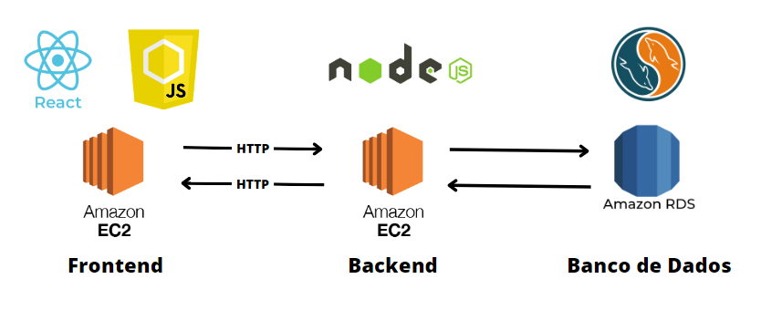
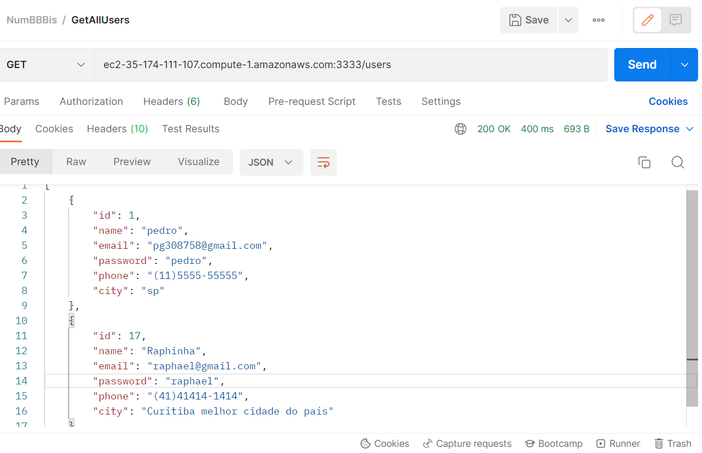
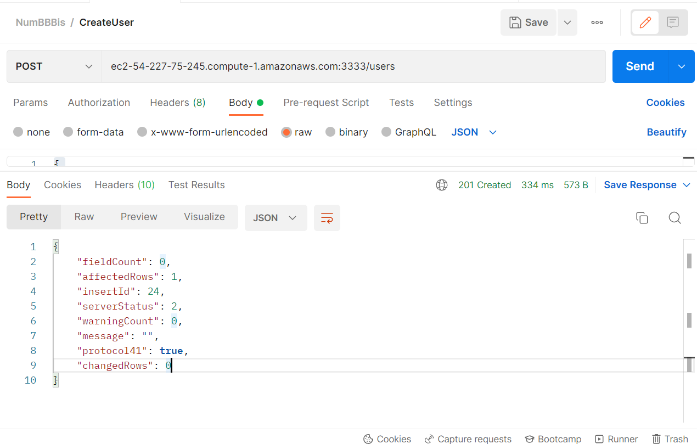
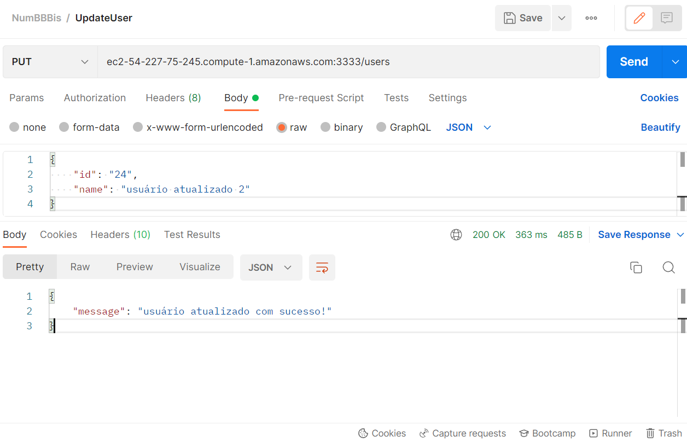

# MVP com deploy da aplicação com arquitetura simples

## Arquitetura da Aplicação

O frontend, criado utilizando React e Javascript, e hospedado em uma instância do Amazon EC2, se comunica com o backend, criado com Node.js e hospedado em outra instância do Amazon EC2, por meio de requisições HTTP para uso da api criada. Já o backend se comunica com uma instância do banco de dados, hospedado no Amazon RDS, por meio de uma biblioteca do MySQL para realizar operações CRUD na tabela desse banco.

## Resultados dos testes das transações REST

### Retornar todos os usuários:
* Endpoint: ec2-54-227-75-245.compute-1.amazonaws.com:3333/users
* Método: GET

Resultado esperado:
* Status: 200(OK)
* Corpo de resposta:
[
    {
        "id": 1,
        "name": "pedro",
        "email": "pg308758@gmail.com",
        "password": "pedro",
        "phone": "(11)5555-55555",
        "city": "sp"
    },
    {
        "id": 17,
        "name": "Raphinha",
        "email": "raphael@gmail.com",
        "password": "raphael",
        "phone": "(41)41414-1414",
        "city": "Curitiba melhor cidade do país"
    }
]

Resultado obtido:
* Status: 200(OK)
* Corpo de resposta:

### Cadastrar usuário:
* Endpoint: ec2-54-227-75-245.compute-1.amazonaws.com:3333/users
* Método: POST
* Corpo de requisição:
{
    "name": "Usuário teste 3",
    "email": "usuario3@gmail.com",
    "password": "usuario12345",
    "phone": "40028922",
    "city": "Belo Horizonte"
}

Resultado esperado:
* Status: 201(CREATED)
* Corpo de resposta:
{
    "fieldCount": 0,
    "affectedRows": 1,
    "insertId": 24,
    "serverStatus": 2,
    "warningCount": 0,
    "message": "",
    "protocol41": true,
    "changedRows": 0
}

Resultado obtido:
* Status: 201(CREATED)
* Corpo de resposta:

### Atualizar usuário:
* Endpoint: ec2-54-227-75-245.compute-1.amazonaws.com:3333/users
* Método: PUT
* Corpo de requisição:
{
    "id": "24",
    "name": "Arthur Reis"
}

Resultado esperado:
* Status: 200(OK)
* Corpo de resposta:
{
    "message": "usuário atualizado com sucesso!"
}

Resultado obtido:
* Status: 200(OK)
* Corpo de resposta:

### Deletar usuário:
* Endpoint: ec2-54-227-75-245.compute-1.amazonaws.com:3333/users/24
* Método: DELETE
* Parâmetro: id do usuário

Resultado esperado:
* Status: 200(OK)
* Corpo de resposta:
{
    "fieldCount": 0,
    "affectedRows": 1,
    "insertId": 0,
    "serverStatus": 2,
    "warningCount": 0,
    "message": "",
    "protocol41": true,
    "changedRows": 0
}

Resultado obtido:
* Status: 200(OK)
* Corpo de resposta:

## Vídeos de demonstração

* Frontend: https://drive.google.com/drive/folders/1Iwxl6G9FbMzaVi-72PR-pimtY0mPgeqf?usp=sharing
* Backend: https://www.loom.com/share/cd165eac40d447338fc95552f146aa76?sid=59c9f0b9-b9b6-45d5-931a-5dd5f339169e

## Demonstração Sprint 2

* Frontend: https://drive.google.com/drive/folders/1vj5gDk73OEhFu9NPVxuKaHIn_UU4eFTa?usp=sharing
* Backend: https://drive.google.com/file/d/1Buquh3E68Je7wASK43yQojNgJW5S_cNT/view?usp=sharing

## Demonstração Sprint 5

* Aplicação final: https://drive.google.com/file/d/1WK1cLfnOL6PYrwB-tU06XiEBOFvyqD1N/view?usp=sharing