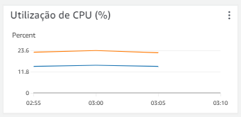

# Relatório Técnico

O objetivo dessa seção é apresentar e testar os requisitos não-funcionais que a aplicação deve seguir e analisar os resultados obtidos.

## Requisitos não funcionais e seus planos de testes

Para apresentar uma visão geral sobre as especificações que a aplicação deve seguir, têm-se definidos 4 requisitos não-funcionais principais, cada um com uma descrição de caso de teste.

### RNF1

`O sistema (Loja) deve suportar, no mínimo, 35 mil requisições por segundo.`

**Descrição do teste:** Será utilizado uma ferramenta chamada K6, no qual irá gerar um determinado número de requisições, a partir disso construir um relatório para avaliar se a loja manteve o funcionamento do sistema.

Os testes foram realizados usando uma ferramenta de testes de carga chamada **K6**. Para isso, instalamos ela na máquina que será usada para executar os testes seguindo o JavaScript a seguir:

<pre>
import http from 'k6/http';
export const options = {
  scenarios: {
    constant_request_rate: {
      executor: 'constant-arrival-rate',
      rate: 35000,
      timeUnit: '1s', // 35000 iterations per second, i.e. 35000 RPS
      duration: '15s',
      preAllocatedVUs: 100, // how large the initial pool of VUs would be
      maxVUs: 35000,
    },
  },
};
export default function () {
  http.get(' !--URL DA PÁGINA QUE SERÁ TESTADA--! ');
}
</pre>

Além do K6, usamos o Grafana para facilitar a visualização dos resultados e possibilitar a analise de métricas específicas dos testes.

Os testes consistem em simular um número específico de requisições à uma url definida no script e monitorar o comportamento da página/endpoint, verificando possíveis falhas nas respostas obtidas. 

O objetivo é verificar se nossa aplicação suporta o objetivo de 35.000(trinta e cinco mil) acessos simultâneos, número de acessos requisitado pelo cliente. Além disso, para verificar a integridade do sistema, serão monitoradas as duas intâncias que recebem o tráfego pelo Load Balancer, ou seja, as instâncias que recebem o tráfego dos testes.

Na aplicação como um todo, estão sendo usados 3 microsserviços, um para as requisições referentes ao usuário, outro para as requisições de produtos e, por último, uma para as vendas.

Cada teste possui 3 imagens anexadas. A **primeira imagem** mostra um monitoramento do uso de CPU das duas instâncias EC2 que hospedam a aplicação, sendo útil para entendermos quais endpoints requerem mais poder computacional e como é a eficiência dessas instâncias, além de monitorarmos o autoscalling, visto que a escalabilidade horizontal de novas instâncias depende do uso de cpu. A **segunda imagem** é um relatório retirado do Grafana, o qual mostra informações importantes como a média de tempo de resposta para as requisições, a mudança no tempo de resposta com o passar do teste, o tempo que uma requisição HTTP passou bloqueada antes de ser enviada, entre outros. Por fim, a **terceira imagem** é um relatório gerado pelo k6 com informações gerais sobre os testes realizados, apresentadas de forma simples e sem representações gráficas, sendo as principais métricas o "http_reqs", que representa quantas requisições foram processadas ao total, e o "http_req_failed", sendo esse a porcentagem dos testes que falharam.

#### ec2UrlUsers

Esse microsserviço é responsável por controlar as requisições referentes à funções de usuários, como criar, acessar, atualizar dados, deletar conta, entre outros.

1. POST - Criar novo usuário - /users

 É possível ver que a resposta às requisições começou a levar um tempo muito grande, chegando a, aproximadamente, 8 segundos no final do teste.

 Com base na métrica, "http_req_failed", verifica-se que esse endpoint apresentou falha a responder 100% das requisições geradas.

2. GET - Obter todos os usuários - /users

 É possível verificar que o teste desse endpoint foi o que resultou em maiores tempos de resposta às requisições, chegando a 42 segundos para obter uma resposta.

3. POST - Logar usuário - /users/login

4. POST - Atualizar senha do usuário - /users/confirm

5. GET - Obter usuário por id - /users/1

6. PUT - Atualizar usuário - /users

7. DELETE - Deletar usuário - /users/1

#### ec2UrlProducts

Esse microsserviço é responsável por controlar as requisições referentes à funções de produtos, sendo elas a listagem de produtos stone e de produtos ton.

1. GET - Obter produtos do tipo Stone - /products/stone

 A imagem acima mostra que o teste desse endpoint foi o que mais estressou as CPU's que hospedam a aplicação, chegando a bater quase 60% de utilização em uma delas.
  

 
 

2. GET - Obter produtos do tipo Ton - /products/ton

 

 

#### ec2UrlSales

Esse microsserviço é responsável por controlar as requisições referentes à funções de vendas, como criar novas, atualizar existentes, deletar vendas e obter todas as vendas em processamento.

1. POST - Criar uma venda - /sales

 Com base na métrica, "http_req_failed", verifica-se que esse endpoint apresentou falha a responder 100% das requisições geradas.

2. PUT - Atualizar uma venda - /sales

3. GET - Obter venda de um usuário em processamento - /sales/1

 Com base nas informações geradas com o teste, verifica-se que esse endpoint foi o que respondeu as requisições em menor tempo, com média de 2.71 segundos.

 Além do menor tempo, verifica-se que esse endpoint foi o que respondeu com sucesso o maior número de requisições por segundo, respondendo com sucesso 100% das 1.691req/seg.

4. DELETE - Deletar uma venda - /sales/1

#### Conclusão sobre os testes de carga

Com base nos testes realizados, nota-se que o número de requisições por segundo foi bastante volátil, alternando entre 200~1700 requisições/segundo para diferentes endpoints, porém, a taxa de sucesso foi de 100% em 11 dos 13 endpoints do sistema, ou seja, a aplicação responde com sucesso na maior parte do tempo. Porém, verifica-se também que o tempo de resposta às requisições pode ser um empecilho, uma vez que, conforme as requisições crescem, o tempo aumenta também.
Por fim, não foi possível verificar o que ocorre na interface em caso de falhas de componentes, uma vez que não conseguimos executar uma carga suficiente para causar algum erro na aplicação, portanto, a interface se manteve a mesma.

### RNF2

`O sistema (Loja) deve permitir ao usuário realizar uma compra com 5 cliques.`

**Descrição do teste:** Os desenvolvedores irão elaborar um teste de usabilidade, no qual irá dar um objetivo que o usuário deve cumprir e verificar quais os passos que ele faz para cumprir, é necessário que o usuário realize a compra em 5 passos.

**Resultados:** Seguindo o fluxo para realizar a compra, desde o momento em que o cliente acessa a landing page até finalizar, são necessários 7 cliques, sendo eles:

1. Da landing page, acessar a área de login.
2. Preencher credenciais e clicar em "Entrar" no login.
3. Clicar em "Contrate agora" no produto desejado.
4. Definir as quantidades e clicar em "continuar".
5. Preencher endereço e "Continuar".
6. Revisar resumo do pedido e "Continuar".
7. Preencher pagamento e clicar em "Finalizar". 

### RNF3

`O sistema (Loja) deve ter disponibilidade de 99,950%.`

**Descrição do teste:** Para testar a disponibilidade deve-se realizar um cálculo que é o tempo disponível para uso dividido pelo tempo total. 

**Resultados:** A plataforma da AWS, já oferece uma tabela em sua documentação mostrando a disponibilidade de cada serviço, sendo que os serviços utlizados no sistema(listados mais detalhadamente na análise de custos) têm a disponibilidade de 99,950%, logo a indisponibilidade máxima por ano é de 4 horas e 22 minutos.